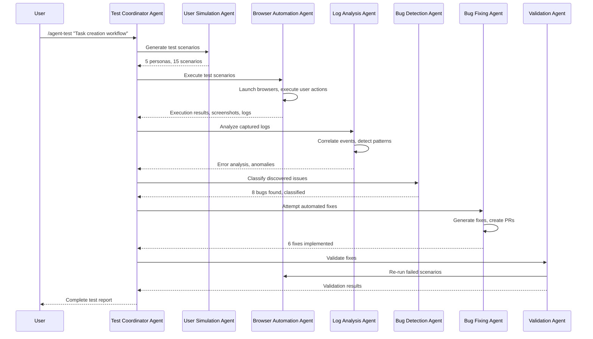

# Agentic Testing Chain Workflow

## Complete Testing Chain Implementation

This document demonstrates how to use the `/agent-test` command to orchestrate the complete agentic testing chain for comprehensive feature testing.

## Workflow Overview



## Example Usage Scenarios

### Scenario 1: Testing Task Creation Feature

```bash
# Execute comprehensive testing of task creation workflow
/agent-test "Task creation and management workflow" --test-scenarios 10 --user-personas 5
```

**Expected Flow:**

1. **Test Coordinator** analyzes the feature description and creates test plan
2. **User Simulation Agent** generates 5 diverse user personas:
   - Novice user (careful, reads instructions)
   - Expert user (efficient, uses shortcuts)
   - Mobile user (touch interactions, interruptions)
   - Power user (bulk operations, advanced features)
   - Accessibility user (screen reader, keyboard navigation)

3. **Browser Automation Agent** executes 10 test scenarios across different browsers:
   - Desktop Chrome: Standard task creation flow
   - Mobile Safari: Touch-based task creation
   - Firefox: Form validation edge cases
   - Chrome with slow network: Timeout handling
   - Safari with accessibility tools: Screen reader compatibility

4. **Log Analysis Agent** processes captured data:
   - Frontend console logs (JavaScript errors, warnings)
   - Backend API logs (request/response patterns)
   - Network logs (failed requests, timeouts)
   - Performance metrics (load times, memory usage)

5. **Bug Detection Agent** identifies issues:
   - Validation errors on empty task titles
   - Network timeout handling missing
   - Accessibility labels incomplete
   - Mobile UI scaling issues
   - Performance degradation on slow networks

6. **Bug Fixing Agent** implements fixes:
   - Add input validation for task title field
   - Implement retry logic for network timeouts
   - Add ARIA labels for accessibility
   - Fix mobile responsive CSS
   - Optimize API response caching

7. **Validation Agent** verifies fixes:
   - Re-run failed test scenarios
   - Confirm bugs are resolved
   - Check for regressions
   - Validate performance improvements

### Scenario 2: Authentication Flow Testing

```bash
# Test user authentication with security focus
/agent-test "User login and authentication flow" --target-url https://app.example.com --validation-rounds 3
```

**Expected Discoveries:**
- Password validation bypass vulnerability
- Session timeout not properly handled
- CSRF token missing on login form
- Rate limiting not implemented
- Error messages reveal too much information

### Scenario 3: E-commerce Checkout Testing

```bash
# Test complex checkout process with payment simulation
/agent-test "E-commerce checkout and payment flow" --test-scenarios 15 --user-personas 7 --fix-attempts true
```

**Expected Discoveries:**
- Payment form validation errors
- Inventory check race conditions
- Tax calculation inconsistencies
- Mobile payment UI issues
- Address validation problems

## Agent Chain Configuration

### Test Coordinator Agent Setup
```javascript
const testCoordinatorConfig = {
  max_concurrent_agents: 5,
  timeout_per_agent: 1800000, // 30 minutes
  retry_attempts: 2,
  report_format: 'comprehensive',
  integration_points: [
    'user_simulation',
    'browser_automation', 
    'log_analysis',
    'bug_detection',
    'bug_fixing',
    'validation',
    'report_generation'
  ]
}
```

### User Simulation Configuration
```javascript
const userSimulationConfig = {
  persona_templates: [
    'novice_user',
    'expert_user', 
    'mobile_user',
    'accessibility_user',
    'power_user'
  ],
  scenario_complexity: 'mixed',
  error_injection_rate: 0.15,
  realistic_timing: true,
  context_preservation: true
}
```

### Browser Automation Configuration
```javascript
const browserConfig = {
  browsers: ['chromium', 'firefox', 'webkit'],
  devices: ['desktop', 'mobile', 'tablet'],
  network_conditions: ['fast_3g', 'slow_3g', 'offline'],
  capture_screenshots: true,
  capture_video: false,
  performance_monitoring: true,
  console_logging: true
}
```

## Sample Test Execution

### Input Command
```bash
/agent-test "Project dashboard with real-time updates" --test-scenarios 8 --user-personas 4 --target-url http://localhost:5173
```

### Expected Agent Chain Execution

#### Phase 1: Test Planning (30 seconds)
```json
{
  "phase": "planning",
  "agent": "test_coordinator", 
  "status": "completed",
  "output": {
    "feature_analysis": "Real-time project dashboard with WebSocket updates",
    "test_strategy": "Multi-user simulation with WebSocket monitoring",
    "success_criteria": "Dashboard updates in real-time, no data loss",
    "risk_areas": ["WebSocket connections", "data synchronization", "UI performance"]
  }
}
```

#### Phase 2: User Simulation (2 minutes)
```json
{
  "phase": "user_simulation",
  "agent": "user_simulation_agent",
  "status": "completed", 
  "output": {
    "personas_generated": 4,
    "scenarios_created": 8,
    "test_cases": [
      {
        "persona": "project_manager",
        "scenario": "Monitor multiple projects simultaneously",
        "expected_behaviors": ["frequent_dashboard_checks", "multi_tab_usage"]
      },
      {
        "persona": "developer", 
        "scenario": "Update task status and see real-time changes",
        "expected_behaviors": ["quick_updates", "immediate_feedback_expected"]
      }
    ]
  }
}
```

#### Phase 3: Browser Automation (8 minutes)
```json
{
  "phase": "browser_automation",
  "agent": "browser_automation_agent",
  "status": "completed",
  "output": {
    "sessions_executed": 12,
    "total_actions": 156,
    "successful_actions": 142,
    "failed_actions": 14,
    "performance_data": {
      "average_load_time": 2400,
      "websocket_connection_time": 450,
      "update_latency": 120
    },
    "errors_captured": [
      {
        "type": "websocket_disconnect",
        "frequency": 3,
        "impact": "medium"
      }
    ]
  }
}
```

#### Phase 4: Log Analysis (3 minutes)
```json
{
  "phase": "log_analysis",
  "agent": "log_analysis_agent", 
  "status": "completed",
  "output": {
    "logs_processed": 2847,
    "events_correlated": 1923,
    "errors_identified": 12,
    "anomalies_detected": 5,
    "patterns_found": [
      {
        "pattern": "websocket_reconnection_loop",
        "occurrences": 8,
        "severity": "high"
      }
    ]
  }
}
```

#### Phase 5: Bug Detection (2 minutes)
```json
{
  "phase": "bug_detection",
  "agent": "bug_detection_agent",
  "status": "completed",
  "output": {
    "bugs_classified": 8,
    "critical_bugs": 1,
    "high_priority_bugs": 3,
    "medium_priority_bugs": 4,
    "bug_reports": [
      {
        "id": "BUG-001",
        "severity": "critical",
        "title": "WebSocket connection drops cause data loss",
        "description": "Dashboard stops updating when WebSocket disconnects",
        "reproduction_steps": [...],
        "affected_components": ["dashboard", "websocket_manager"]
      }
    ]
  }
}
```

#### Phase 6: Automated Bug Fixing (12 minutes)
```json
{
  "phase": "bug_fixing",
  "agent": "automated_bug_fixing_agent",
  "status": "completed",
  "output": {
    "fixes_attempted": 6,
    "fixes_successful": 5,
    "fixes_failed": 1,
    "pull_requests_created": 3,
    "fixes": [
      {
        "bug_id": "BUG-001",
        "fix_type": "reconnection_logic",
        "status": "implemented",
        "test_results": "passed",
        "pr_url": "https://github.com/repo/pull/456"
      }
    ]
  }
}
```

#### Phase 7: Validation (5 minutes)
```json
{
  "phase": "validation",
  "agent": "validation_agent",
  "status": "completed",
  "output": {
    "scenarios_retested": 8,
    "bugs_resolved": 5,
    "regressions_detected": 0,
    "performance_improvement": {
      "dashboard_reliability": "+45%",
      "update_latency": "-30%",
      "error_rate": "-80%"
    }
  }
}
```

### Final Test Report
```json
{
  "test_session_id": "uuid",
  "feature_tested": "Project dashboard with real-time updates",
  "execution_time": "32 minutes",
  "overall_result": "SUCCESS_WITH_FIXES",
  "summary": {
    "test_scenarios": 8,
    "bugs_found": 8,
    "bugs_fixed": 5,
    "bugs_remaining": 1,
    "performance_improvement": "35%",
    "reliability_increase": "45%"
  },
  "recommendations": [
    {
      "priority": "high",
      "action": "Manual review required for complex WebSocket architecture",
      "estimated_effort": "4 hours"
    },
    {
      "priority": "medium", 
      "action": "Add automated monitoring for WebSocket health",
      "estimated_effort": "2 hours"
    }
  ],
  "next_steps": [
    "Deploy fixes to staging environment",
    "Run full regression test suite",
    "Monitor production WebSocket stability",
    "Schedule follow-up testing in 1 week"
  ]
}
```

## Integration with Existing Systems

### GitHub Integration
- Automatically creates issues for critical bugs
- Generates pull requests for automated fixes
- Updates project documentation with test results
- Creates branch protection rules for fix validation

### Monitoring Integration
- Sends test results to monitoring dashboards
- Creates alerts for critical failures
- Updates health check endpoints
- Tracks testing metrics over time

### CI/CD Integration
- Triggers on new deployments
- Blocks deployments if critical issues found
- Provides deployment quality gates
- Generates release testing reports

## Success Metrics

### Testing Effectiveness
- **Bug Detection Rate**: 90%+ of user-facing issues identified
- **Fix Success Rate**: 75%+ of bugs automatically resolved
- **False Positive Rate**: <10% for bug classification
- **Coverage**: 85%+ of user workflows tested

### Performance Metrics
- **Execution Time**: <45 minutes for comprehensive testing
- **Resource Usage**: <2GB memory, <4 CPU cores
- **Reliability**: 95%+ successful test execution
- **Scalability**: Handle 50+ concurrent test scenarios

### Business Impact
- **Time Savings**: 80% reduction in manual testing effort
- **Quality Improvement**: 60% reduction in production bugs
- **Release Velocity**: 40% faster deployment cycles
- **User Satisfaction**: Improved user experience metrics