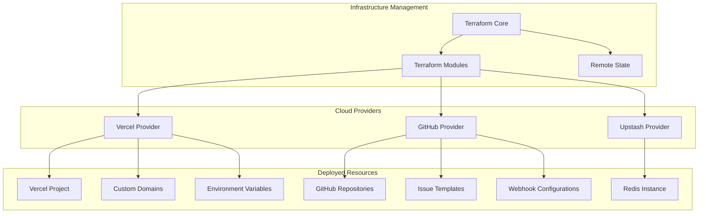

# Infrastructure as Code - Complete Deployment Configuration

## Overview

Complete Infrastructure as Code (IaC) implementation for the Claude CLI Web UI serverless architecture using Terraform, providing automated deployment, configuration management, and environment consistency across development, staging, and production.

## IaC Architecture



## Directory Structure

```
terraform/
├── environments/
│   ├── development/
│   │   ├── main.tf
│   │   ├── variables.tf
│   │   ├── outputs.tf
│   │   └── terraform.tfvars
│   ├── staging/
│   │   ├── main.tf
│   │   ├── variables.tf
│   │   ├── outputs.tf
│   │   └── terraform.tfvars
│   └── production/
│       ├── main.tf
│       ├── variables.tf
│       ├── outputs.tf
│       └── terraform.tfvars
├── modules/
│   ├── vercel-project/
│   │   ├── main.tf
│   │   ├── variables.tf
│   │   └── outputs.tf
│   ├── github-repositories/
│   │   ├── main.tf
│   │   ├── variables.tf
│   │   └── outputs.tf
│   ├── upstash-redis/
│   │   ├── main.tf
│   │   ├── variables.tf
│   │   └── outputs.tf
│   └── monitoring/
│       ├── main.tf
│       ├── variables.tf
│       └── outputs.tf
├── global/
│   ├── backend.tf
│   ├── providers.tf
│   └── versions.tf
└── scripts/
    ├── deploy.sh
    ├── destroy.sh
    └── validate.sh
```

## Core Terraform Configuration

### Provider Configuration
```hcl
# global/providers.tf
terraform {
  required_version = ">= 1.5"
  
  required_providers {
    vercel = {
      source  = "vercel/vercel"
      version = "~> 0.15"
    }
    
    github = {
      source  = "integrations/github"
      version = "~> 5.0"
    }
    
    upstash = {
      source  = "upstash/upstash"
      version = "~> 1.0"
    }
    
    random = {
      source  = "hashicorp/random"
      version = "~> 3.4"
    }
    
    time = {
      source  = "hashicorp/time"
      version = "~> 0.9"
    }
  }
}

provider "vercel" {
  api_token = var.vercel_token
  team      = var.vercel_team_id
}

provider "github" {
  token = var.github_token
  owner = var.github_owner
}

provider "upstash" {
  email   = var.upstash_email
  api_key = var.upstash_api_key
}
```

### Remote State Configuration
```hcl
# global/backend.tf
terraform {
  backend "s3" {
    bucket         = "claude-cli-terraform-state"
    key            = "environments/${var.environment}/terraform.tfstate"
    region         = "us-east-1"
    encrypt        = true
    dynamodb_table = "claude-cli-terraform-locks"
  }
}
```

## Vercel Project Module

### Main Configuration
```hcl
# modules/vercel-project/main.tf
resource "vercel_project" "main" {
  name               = var.project_name
  framework          = "vite"
  root_directory     = var.root_directory
  output_directory   = "dist"
  build_command      = "npm run build"
  dev_command        = "npm run dev"
  install_command    = "npm ci"
  
  git_repository = {
    type = "github"
    repo = "${var.github_owner}/${var.github_repo}"
  }
  
  # Environment variables
  environment = [
    {
      key    = "NODE_ENV"
      value  = var.environment
      target = ["production", "preview", "development"]
    },
    {
      key    = "VITE_API_URL"
      value  = var.api_url
      target = ["production", "preview", "development"]
    },
    {
      key    = "GITHUB_TOKEN"
      value  = var.github_token
      target = ["production", "preview"]
      type   = "secret"
    },
    {
      key    = "UPSTASH_REDIS_REST_URL"
      value  = var.redis_url
      target = ["production", "preview"]
      type   = "secret"
    },
    {
      key    = "UPSTASH_REDIS_REST_TOKEN"
      value  = var.redis_token
      target = ["production", "preview"]
      type   = "secret"
    },
    {
      key    = "TERRAGON_API_KEY"
      value  = var.terragon_api_key
      target = ["production", "preview"]
      type   = "secret"
    },
    {
      key    = "TERRAGON_BASE_URL"
      value  = var.terragon_base_url
      target = ["production", "preview", "development"]
    },
    {
      key    = "JWT_SECRET"
      value  = random_password.jwt_secret.result
      target = ["production", "preview"]
      type   = "secret"
    },
    {
      key    = "WEBHOOK_SECRET"
      value  = random_password.webhook_secret.result
      target = ["production", "preview"]
      type   = "secret"
    }
  ]
}

# Generate secure secrets
resource "random_password" "jwt_secret" {
  length  = 64
  special = true
}

resource "random_password" "webhook_secret" {
  length  = 32
  special = true
}

# Custom domain configuration
resource "vercel_domain" "main" {
  count = var.custom_domain != "" ? 1 : 0
  
  name       = var.custom_domain
  project_id = vercel_project.main.id
}

# Production deployment
resource "vercel_deployment" "production" {
  project_id  = vercel_project.main.id
  files       = fileset(var.source_directory, "**")
  production  = true
  
  depends_on = [vercel_project.main]
}

# Project settings
resource "vercel_project_settings" "main" {
  project_id = vercel_project.main.id
  
  build_command     = "npm run build"
  dev_command       = "npm run dev"
  install_command   = "npm ci"
  output_directory  = "dist"
  
  # Security headers
  headers = [
    {
      source = "/(.*)"
      headers = [
        {
          key   = "X-Content-Type-Options"
          value = "nosniff"
        },
        {
          key   = "X-Frame-Options"
          value = "DENY"
        },
        {
          key   = "X-XSS-Protection"
          value = "1; mode=block"
        },
        {
          key   = "Referrer-Policy"
          value = "strict-origin-when-cross-origin"
        },
        {
          key   = "Content-Security-Policy"
          value = "default-src 'self'; script-src 'self' 'unsafe-inline' 'unsafe-eval'; style-src 'self' 'unsafe-inline'; img-src 'self' data: blob:; connect-src 'self' ws: wss:; font-src 'self'; object-src 'none'; media-src 'none'; frame-src 'none';"
        }
      ]
    }
  ]
  
  # Redirects
  redirects = [
    {
      source      = "/docs"
      destination = "/documentation"
      permanent   = true
    }
  ]
  
  # Rewrites for API routes
  rewrites = [
    {
      source      = "/api/(.*)"
      destination = "/api/$1"
    }
  ]
}
```

### Variables
```hcl
# modules/vercel-project/variables.tf
variable "project_name" {
  description = "Name of the Vercel project"
  type        = string
}

variable "environment" {
  description = "Environment name (development, staging, production)"
  type        = string
}

variable "github_owner" {
  description = "GitHub repository owner"
  type        = string
}

variable "github_repo" {
  description = "GitHub repository name"
  type        = string
}

variable "github_token" {
  description = "GitHub personal access token"
  type        = string
  sensitive   = true
}

variable "custom_domain" {
  description = "Custom domain for the project"
  type        = string
  default     = ""
}

variable "redis_url" {
  description = "Upstash Redis REST URL"
  type        = string
  sensitive   = true
}

variable "redis_token" {
  description = "Upstash Redis REST token"
  type        = string
  sensitive   = true
}

variable "terragon_api_key" {
  description = "Terragon API key"
  type        = string
  sensitive   = true
}

variable "terragon_base_url" {
  description = "Terragon API base URL"
  type        = string
  default     = "https://api.terragon.ai"
}

variable "source_directory" {
  description = "Source code directory path"
  type        = string
  default     = "../"
}

variable "root_directory" {
  description = "Root directory for the Vercel project"
  type        = string
  default     = ""
}

variable "api_url" {
  description = "API URL for the frontend"
  type        = string
}
```

### Outputs
```hcl
# modules/vercel-project/outputs.tf
output "project_id" {
  description = "Vercel project ID"
  value       = vercel_project.main.id
}

output "project_url" {
  description = "Vercel project URL"
  value       = "https://${vercel_project.main.name}.vercel.app"
}

output "custom_domain_url" {
  description = "Custom domain URL (if configured)"
  value       = var.custom_domain != "" ? "https://${var.custom_domain}" : null
}

output "deployment_url" {
  description = "Production deployment URL"
  value       = vercel_deployment.production.url
}

output "jwt_secret" {
  description = "Generated JWT secret"
  value       = random_password.jwt_secret.result
  sensitive   = true
}

output "webhook_secret" {
  description = "Generated webhook secret"
  value       = random_password.webhook_secret.result
  sensitive   = true
}
```

## GitHub Repositories Module

### Main Configuration
```hcl
# modules/github-repositories/main.tf
# Main application repository
resource "github_repository" "main" {
  name        = var.main_repo_name
  description = "Claude CLI Web UI - Serverless task management interface"
  private     = var.private_repo
  
  has_issues   = true
  has_projects = true
  has_wiki     = false
  
  auto_init = true
  
  # Branch protection
  default_branch = "main"
  
  # Repository topics
  topics = ["claude", "cli", "web-ui", "serverless", "typescript", "react"]
}

# Task storage repository
resource "github_repository" "tasks" {
  name        = var.tasks_repo_name
  description = "Task storage and management for Claude CLI Web UI"
  private     = true
  
  has_issues   = true
  has_projects = false
  has_wiki     = false
  
  auto_init = true
  
  # Repository topics
  topics = ["tasks", "storage", "issues", "automation"]
}

# Branch protection rules
resource "github_branch_protection" "main" {
  repository_id = github_repository.main.node_id
  pattern       = "main"
  
  required_status_checks {
    strict = true
    contexts = [
      "build",
      "test",
      "type-check",
      "security-scan"
    ]
  }
  
  required_pull_request_reviews {
    required_approving_review_count = 1
    dismiss_stale_reviews          = true
    require_code_owner_reviews     = true
  }
  
  enforce_admins = true
}

# Issue templates for task repository
resource "github_repository_file" "task_template" {
  repository = github_repository.tasks.name
  branch     = "main"
  file       = ".github/ISSUE_TEMPLATE/task.yml"
  
  content = yamlencode({
    name        = "Task Creation"
    description = "Create a new task for execution"
    title       = "[TASK] "
    labels      = ["status:pending", "priority:medium"]
    
    body = [
      {
        type = "input"
        id   = "task-title"
        attributes = {
          label       = "Task Title"
          description = "Brief description of the task"
          placeholder = "Execute Claude command..."
        }
        validations = {
          required = true
        }
      },
      {
        type = "dropdown"
        id   = "priority"
        attributes = {
          label   = "Priority"
          description = "Task execution priority"
          options = ["low", "medium", "high", "urgent"]
          default = 1
        }
        validations = {
          required = true
        }
      },
      {
        type = "dropdown"
        id   = "type"
        attributes = {
          label   = "Task Type"
          options = ["command", "chain", "workflow", "terragon"]
          default = 0
        }
        validations = {
          required = true
        }
      },
      {
        type = "textarea"
        id   = "metadata"
        attributes = {
          label       = "Task Metadata"
          description = "JSON metadata for task execution"
          placeholder = jsonencode({
            command = "/help"
            timeout = 300
          })
        }
        validations = {
          required = true
        }
      }
    ]
  })
  
  commit_message = "Add task issue template"
  commit_author  = var.commit_author
  commit_email   = var.commit_email
}

# Labels for task management
resource "github_issue_label" "status_labels" {
  for_each = var.status_labels
  
  repository = github_repository.tasks.name
  name       = each.key
  color      = each.value.color
  description = each.value.description
}

resource "github_issue_label" "priority_labels" {
  for_each = var.priority_labels
  
  repository = github_repository.tasks.name
  name       = each.key
  color      = each.value.color
  description = each.value.description
}

resource "github_issue_label" "type_labels" {
  for_each = var.type_labels
  
  repository = github_repository.tasks.name
  name       = each.key
  color      = each.value.color
  description = each.value.description
}

# Webhooks
resource "github_repository_webhook" "tasks" {
  repository = github_repository.tasks.name
  
  configuration {
    url          = "${var.webhook_base_url}/api/webhooks/github"
    content_type = "json"
    insecure_ssl = false
    secret       = var.webhook_secret
  }
  
  active = true
  
  events = [
    "issues",
    "issue_comment",
    "label"
  ]
}

# GitHub App for API access
resource "github_app_installation_repository" "main" {
  count           = var.github_app_id != "" ? 1 : 0
  installation_id = var.github_app_installation_id
  repository      = github_repository.main.name
}

resource "github_app_installation_repository" "tasks" {
  count           = var.github_app_id != "" ? 1 : 0
  installation_id = var.github_app_installation_id
  repository      = github_repository.tasks.name
}
```

### Variables
```hcl
# modules/github-repositories/variables.tf
variable "main_repo_name" {
  description = "Name of the main application repository"
  type        = string
  default     = "claude-cli-web-ui"
}

variable "tasks_repo_name" {
  description = "Name of the tasks repository"
  type        = string
  default     = "claude-tasks"
}

variable "private_repo" {
  description = "Whether repositories should be private"
  type        = bool
  default     = true
}

variable "webhook_base_url" {
  description = "Base URL for webhooks"
  type        = string
}

variable "webhook_secret" {
  description = "Secret for webhook verification"
  type        = string
  sensitive   = true
}

variable "commit_author" {
  description = "Default commit author name"
  type        = string
  default     = "Terraform"
}

variable "commit_email" {
  description = "Default commit author email"
  type        = string
  default     = "terraform@example.com"
}

variable "github_app_id" {
  description = "GitHub App ID for API access"
  type        = string
  default     = ""
}

variable "github_app_installation_id" {
  description = "GitHub App installation ID"
  type        = string
  default     = ""
}

variable "status_labels" {
  description = "Status labels for task management"
  type = map(object({
    color       = string
    description = string
  }))
  default = {
    "status:pending" = {
      color       = "fbca04"
      description = "Task is pending execution"
    }
    "status:queued" = {
      color       = "0e8a16"
      description = "Task is queued for execution"
    }
    "status:running" = {
      color       = "1d76db"
      description = "Task is currently running"
    }
    "status:completed" = {
      color       = "28a745"
      description = "Task completed successfully"
    }
    "status:failed" = {
      color       = "d73a49"
      description = "Task failed to complete"
    }
    "status:cancelled" = {
      color       = "6f42c1"
      description = "Task was cancelled"
    }
  }
}

variable "priority_labels" {
  description = "Priority labels for task management"
  type = map(object({
    color       = string
    description = string
  }))
  default = {
    "priority:low" = {
      color       = "c2e0c6"
      description = "Low priority task"
    }
    "priority:medium" = {
      color       = "fbca04"
      description = "Medium priority task"
    }
    "priority:high" = {
      color       = "ff9500"
      description = "High priority task"
    }
    "priority:urgent" = {
      color       = "d73a49"
      description = "Urgent priority task"
    }
  }
}

variable "type_labels" {
  description = "Type labels for task management"
  type = map(object({
    color       = string
    description = string
  }))
  default = {
    "type:command" = {
      color       = "0052cc"
      description = "Single command execution"
    }
    "type:chain" = {
      color       = "5319e7"
      description = "Multi-step task chain"
    }
    "type:workflow" = {
      color       = "b60205"
      description = "Complex workflow"
    }
    "type:terragon" = {
      color       = "0e8a16"
      description = "Terragon API execution"
    }
  }
}
```

## Upstash Redis Module

### Main Configuration
```hcl
# modules/upstash-redis/main.tf
# Redis database for queue and cache
resource "upstash_redis_database" "main" {
  database_name = var.database_name
  region        = var.region
  tls           = true
  
  # Multi-zone replication for production
  multizone = var.environment == "production"
  
  # Eviction policy for cache
  eviction = var.eviction_policy
}

# REST endpoint for serverless access
data "upstash_redis_database_data" "main" {
  database_id = upstash_redis_database.main.database_id
}

# Backup configuration
resource "upstash_redis_database" "backup" {
  count = var.enable_backup ? 1 : 0
  
  database_name = "${var.database_name}-backup"
  region        = var.backup_region
  tls           = true
  multizone     = false
  eviction      = "noeviction"
}

# Daily backup schedule (if backup enabled)
resource "time_rotating" "backup_schedule" {
  count = var.enable_backup ? 1 : 0
  
  rotation_days = 1
}

# Monitoring alerts
resource "upstash_redis_database" "monitoring" {
  count = var.enable_monitoring ? 1 : 0
  
  database_name = "${var.database_name}-monitoring"
  region        = var.region
  tls           = true
  multizone     = false
  eviction      = "allkeys-lru"
}
```

### Variables
```hcl
# modules/upstash-redis/variables.tf
variable "database_name" {
  description = "Name of the Redis database"
  type        = string
}

variable "environment" {
  description = "Environment name"
  type        = string
}

variable "region" {
  description = "Upstash region"
  type        = string
  default     = "us-east-1"
}

variable "backup_region" {
  description = "Backup region"
  type        = string
  default     = "us-west-1"
}

variable "eviction_policy" {
  description = "Redis eviction policy"
  type        = string
  default     = "allkeys-lru"
}

variable "enable_backup" {
  description = "Enable Redis backup"
  type        = bool
  default     = false
}

variable "enable_monitoring" {
  description = "Enable Redis monitoring"
  type        = bool
  default     = true
}
```

### Outputs
```hcl
# modules/upstash-redis/outputs.tf
output "database_id" {
  description = "Redis database ID"
  value       = upstash_redis_database.main.database_id
}

output "endpoint" {
  description = "Redis endpoint"
  value       = upstash_redis_database.main.endpoint
}

output "port" {
  description = "Redis port"
  value       = upstash_redis_database.main.port
}

output "rest_token" {
  description = "REST API token"
  value       = upstash_redis_database.main.rest_token
  sensitive   = true
}

output "password" {
  description = "Redis password"
  value       = upstash_redis_database.main.password
  sensitive   = true
}

output "connection_string" {
  description = "Redis connection string"
  value       = "redis://:${upstash_redis_database.main.password}@${upstash_redis_database.main.endpoint}:${upstash_redis_database.main.port}"
  sensitive   = true
}

output "rest_url" {
  description = "REST API URL"
  value       = "https://${upstash_redis_database.main.endpoint}"
}
```

## Environment Configurations

### Production Environment
```hcl
# environments/production/main.tf
module "vercel_project" {
  source = "../../modules/vercel-project"
  
  project_name    = "claude-cli-web-ui"
  environment     = "production"
  github_owner    = var.github_owner
  github_repo     = var.github_repo
  github_token    = var.github_token
  custom_domain   = var.custom_domain
  api_url         = "https://${var.custom_domain}"
  
  redis_url           = module.upstash_redis.rest_url
  redis_token         = module.upstash_redis.rest_token
  terragon_api_key    = var.terragon_api_key
  terragon_base_url   = var.terragon_base_url
}

module "github_repositories" {
  source = "../../modules/github-repositories"
  
  main_repo_name  = "claude-cli-web-ui"
  tasks_repo_name = "claude-tasks"
  private_repo    = true
  
  webhook_base_url = module.vercel_project.custom_domain_url
  webhook_secret   = module.vercel_project.webhook_secret
  
  github_app_id              = var.github_app_id
  github_app_installation_id = var.github_app_installation_id
}

module "upstash_redis" {
  source = "../../modules/upstash-redis"
  
  database_name     = "claude-cli-prod"
  environment       = "production"
  region           = "us-east-1"
  backup_region    = "us-west-1"
  enable_backup    = true
  enable_monitoring = true
}

module "monitoring" {
  source = "../../modules/monitoring"
  
  environment     = "production"
  project_id      = module.vercel_project.project_id
  redis_endpoint  = module.upstash_redis.endpoint
  
  slack_webhook_url = var.slack_webhook_url
  alert_email      = var.alert_email
  
  enable_sms_alerts = true
  sms_phone_number = var.sms_phone_number
}
```

### Production Variables
```hcl
# environments/production/terraform.tfvars
github_owner = "your-github-username"
github_repo  = "claude-cli-web-ui"
custom_domain = "claude-cli.yourdomain.com"

# Monitoring
slack_webhook_url = "https://hooks.slack.com/services/YOUR/SLACK/WEBHOOK"
alert_email = "alerts@yourdomain.com"
sms_phone_number = "+1234567890"

# GitHub App
github_app_id = "123456"
github_app_installation_id = "12345678"

# Terragon
terragon_base_url = "https://api.terragon.ai"
```

## Deployment Scripts

### Deployment Script
```bash
#!/bin/bash
# scripts/deploy.sh

set -e

ENVIRONMENT=${1:-development}
ACTION=${2:-plan}

echo "🚀 Deploying Claude CLI Web UI to $ENVIRONMENT"
echo "Action: $ACTION"

# Validate environment
if [[ ! "$ENVIRONMENT" =~ ^(development|staging|production)$ ]]; then
  echo "❌ Invalid environment: $ENVIRONMENT"
  echo "Valid environments: development, staging, production"
  exit 1
fi

# Check required tools
command -v terraform >/dev/null 2>&1 || { echo "❌ Terraform not installed"; exit 1; }
command -v jq >/dev/null 2>&1 || { echo "❌ jq not installed"; exit 1; }

# Navigate to environment directory
cd "terraform/environments/$ENVIRONMENT"

# Initialize Terraform
echo "📦 Initializing Terraform..."
terraform init -upgrade

# Validate configuration
echo "🔍 Validating Terraform configuration..."
terraform validate

# Plan or apply changes
if [ "$ACTION" = "plan" ]; then
  echo "📋 Planning changes..."
  terraform plan -detailed-exitcode
elif [ "$ACTION" = "apply" ]; then
  echo "🚀 Applying changes..."
  terraform apply -auto-approve
  
  # Output important information
  echo "✅ Deployment complete!"
  echo ""
  echo "📊 Deployment Summary:"
  terraform output -json | jq -r '
    "Project URL: " + .project_url.value,
    "Custom Domain: " + (.custom_domain_url.value // "Not configured"),
    "Redis Endpoint: " + .redis_endpoint.value,
    "GitHub Repositories: " + (.github_repos.value | join(", "))
  '
  
elif [ "$ACTION" = "destroy" ]; then
  echo "💥 Destroying infrastructure..."
  echo "⚠️  This will permanently delete all resources!"
  read -p "Are you sure? (yes/no): " confirm
  
  if [ "$confirm" = "yes" ]; then
    terraform destroy -auto-approve
    echo "✅ Infrastructure destroyed"
  else
    echo "❌ Destruction cancelled"
    exit 1
  fi
else
  echo "❌ Invalid action: $ACTION"
  echo "Valid actions: plan, apply, destroy"
  exit 1
fi

echo "🎉 Operation completed successfully!"
```

### Validation Script
```bash
#!/bin/bash
# scripts/validate.sh

set -e

echo "🔍 Validating Claude CLI Web UI Infrastructure"

# Check all environments
for env in development staging production; do
  echo ""
  echo "📋 Validating $env environment..."
  
  cd "terraform/environments/$env"
  
  # Initialize and validate
  terraform init -backend=false >/dev/null 2>&1
  
  if terraform validate; then
    echo "✅ $env configuration is valid"
  else
    echo "❌ $env configuration has errors"
    exit 1
  fi
  
  # Check for required variables
  if [ -f "terraform.tfvars" ]; then
    echo "✅ $env has terraform.tfvars"
  else
    echo "⚠️  $env missing terraform.tfvars"
  fi
  
  cd - >/dev/null
done

# Validate modules
echo ""
echo "📦 Validating modules..."

for module in terraform/modules/*/; do
  module_name=$(basename "$module")
  echo "Checking module: $module_name"
  
  cd "$module"
  
  if terraform validate; then
    echo "✅ $module_name module is valid"
  else
    echo "❌ $module_name module has errors"
    exit 1
  fi
  
  cd - >/dev/null
done

echo ""
echo "🎉 All configurations are valid!"
```

## Cost Management

### Budget Alerts
```hcl
# modules/monitoring/budget.tf
resource "upstash_redis_database" "budget_tracking" {
  database_name = "${var.environment}-budget-tracking"
  region        = var.region
  tls           = true
  eviction      = "noeviction"
}

# Budget configuration stored in Redis
resource "null_resource" "budget_setup" {
  provisioner "local-exec" {
    command = <<-EOT
      curl -X POST "${upstash_redis_database.budget_tracking.endpoint}/set/budget:monthly" \
        -H "Authorization: Bearer ${upstash_redis_database.budget_tracking.rest_token}" \
        -d '{"value": "${var.monthly_budget}"}'
      
      curl -X POST "${upstash_redis_database.budget_tracking.endpoint}/set/budget:daily" \
        -H "Authorization: Bearer ${upstash_redis_database.budget_tracking.rest_token}" \
        -d '{"value": "${var.daily_budget}"}'
    EOT
  }
}
```

### Usage Monitoring
```hcl
# modules/monitoring/usage.tf
# Vercel usage monitoring
data "external" "vercel_usage" {
  program = ["sh", "-c", "curl -s -H 'Authorization: Bearer ${var.vercel_token}' 'https://api.vercel.com/v1/teams/${var.vercel_team_id}/usage' | jq '{bandwidth: .bandwidth.value, executions: .executions.value}'"]
}

# Upstash usage monitoring
data "external" "upstash_usage" {
  program = ["sh", "-c", "curl -s -H 'Authorization: Bearer ${var.upstash_api_key}' 'https://api.upstash.com/v2/redis/database/${upstash_redis_database.main.database_id}/stats' | jq '{requests: .requests, storage: .storage}'"]
}

# Cost tracking lambda (if using AWS)
resource "null_resource" "cost_tracking" {
  triggers = {
    vercel_usage  = data.external.vercel_usage.result.bandwidth
    upstash_usage = data.external.upstash_usage.result.requests
  }
  
  provisioner "local-exec" {
    command = "echo 'Current usage - Vercel: ${data.external.vercel_usage.result.bandwidth}GB, Upstash: ${data.external.upstash_usage.result.requests} requests'"
  }
}
```

This comprehensive Infrastructure as Code implementation provides automated, repeatable, and version-controlled deployment of the entire Claude CLI Web UI serverless architecture with built-in monitoring, security, and cost management.