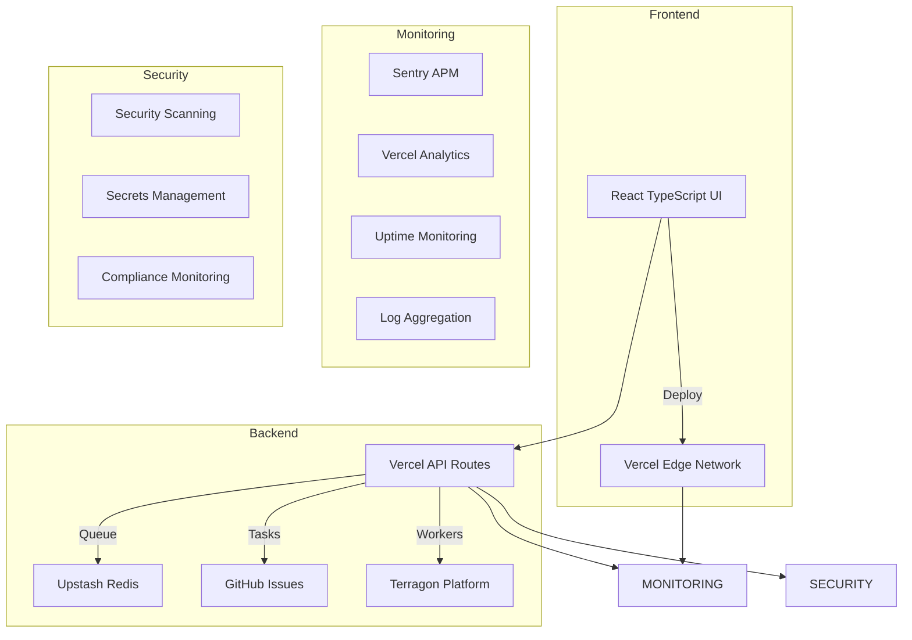

# Claude CLI Web UI - Infrastructure Deployment Guide

## Overview

This guide provides comprehensive instructions for deploying the complete infrastructure and automation for the Claude CLI Web UI, a serverless application with Terragon integration, GitHub Issues-based task storage, Upstash Redis queue management, and comprehensive monitoring.

## Architecture Overview



## Prerequisites

### Required Accounts and Services

1. **Vercel Account** - For serverless deployment
   - Sign up at https://vercel.com
   - Install Vercel CLI: `npm install -g vercel`

2. **GitHub Account** - For repository and Issues-based task storage
   - Repository for the main application
   - Repository for task storage (optional separate repo)

3. **Upstash Account** - For Redis queue management
   - Sign up at https://upstash.com
   - Get API credentials

4. **Terragon Account** - For worker deployment platform
   - Sign up at https://terragon.ai
   - Get API key and access credentials

5. **Monitoring Services**
   - Sentry account for error tracking
   - Slack workspace for notifications (optional)

### Required Tools

```bash
# Install required tools
npm install -g vercel
npm install -g @vercel/cli

# Verify installations
node --version  # Should be 18.x or higher
npm --version
vercel --version
curl --version
jq --version    # For JSON processing
```

## Step-by-Step Deployment

### Phase 1: Environment Setup

1. **Clone and Setup Repository**
```bash
git clone <your-repository-url>
cd claude-cli-web-ui

# Install dependencies
cd frontend && npm install
cd ../backend-vercel && npm install
cd ..
```

2. **Environment Configuration**
```bash
# Copy environment template
cp .env.example .env

# Edit .env with your actual values
# See "Environment Variables" section below for required values
```

### Phase 2: Upstash Redis Setup

1. **Run Redis Setup Script**
```bash
# Set Upstash credentials
export UPSTASH_EMAIL="your-email@domain.com"
export UPSTASH_API_KEY="your-upstash-api-key"

# Run setup script
chmod +x infrastructure/redis-setup.sh
./infrastructure/redis-setup.sh production
```

2. **Verify Redis Configuration**
```bash
# Check generated configuration
cat infrastructure/redis-config-production.json

# Test Redis connection (optional)
curl -X POST "https://your-redis-instance.upstash.io/ping" \
  -H "Authorization: Bearer your-rest-token"
```

### Phase 3: Terragon API Integration

1. **Run Terragon Setup Script**
```bash
# Set Terragon credentials
export TERRAGON_API_KEY="trg_your-terragon-api-key"

# Run setup script
chmod +x infrastructure/terragon-setup.sh
./infrastructure/terragon-setup.sh production "https://your-domain.vercel.app"
```

2. **Verify Terragon Integration**
```bash
# Check generated configuration
cat infrastructure/terragon-integration-production.json

# Test API connection
curl -X GET "https://api.terragon.ai/v1/health" \
  -H "Authorization: Bearer $TERRAGON_API_KEY"
```

### Phase 4: Vercel Deployment

1. **Login to Vercel**
```bash
vercel login
```

2. **Initial Deployment**
```bash
# Deploy using the deployment script
chmod +x deploy.sh
./deploy.sh production deploy
```

3. **Configure Environment Variables in Vercel**
```bash
# Add environment variables from .env to Vercel project
vercel env add GITHUB_TOKEN
vercel env add UPSTASH_REDIS_REST_URL
vercel env add UPSTASH_REDIS_REST_TOKEN
vercel env add TERRAGON_API_KEY
vercel env add JWT_SECRET
# ... add all required environment variables
```

### Phase 5: GitHub Repository Configuration

1. **Setup GitHub Issues Templates**
```bash
# Issue templates are automatically created in .github/ISSUE_TEMPLATE/
# Commit and push these to your repository
git add .github/
git commit -m "Add GitHub issue templates for task management"
git push origin main
```

2. **Configure Repository Settings**
- Enable Issues in repository settings
- Set up branch protection rules
- Configure webhooks (optional, for real-time updates)

### Phase 6: Monitoring and Observability

1. **Run Monitoring Setup**
```bash
# Setup monitoring configuration
chmod +x infrastructure/monitoring-setup.sh
./infrastructure/monitoring-setup.sh production
```

2. **Configure Sentry**
```bash
# Create Sentry project and get DSN
# Add SENTRY_DSN to Vercel environment variables
vercel env add SENTRY_DSN
```

3. **Setup Uptime Monitoring**
- Configure uptime monitoring service (UptimeRobot, Pingdom, etc.)
- Use endpoints from `uptime-monitoring-config.json`

### Phase 7: Security and Compliance

1. **Setup Security Scanning**
```bash
# Security workflows are configured in .github/workflows/security-scan.yml
# Add required secrets to GitHub repository:
# - SNYK_TOKEN
# - SEMGREP_APP_TOKEN
# - GITLEAKS_LICENSE (optional)
```

2. **Configure Secrets in GitHub**
```bash
# Go to repository Settings > Secrets and variables > Actions
# Add the following secrets:
# - VERCEL_TOKEN
# - VERCEL_ORG_ID
# - VERCEL_PROJECT_ID
# - SNYK_TOKEN
# - SLACK_WEBHOOK_URL
# - SENTRY_AUTH_TOKEN
```

## Environment Variables

### Required Environment Variables

Create a `.env` file with the following variables:

```bash
# Application Configuration
NODE_ENV=production
APP_NAME=claude-cli-web-ui
VITE_API_URL=https://your-domain.vercel.app

# Authentication & Security
JWT_SECRET=your-super-secure-jwt-secret-min-64-chars
WEBHOOK_SECRET=your-webhook-secret-for-github
ENCRYPTION_KEY=your-32-char-encryption-key

# GitHub Integration
GITHUB_TOKEN=ghp_your-github-personal-access-token
GITHUB_OWNER=your-github-username
GITHUB_REPO_MAIN=claude-cli-web-ui
GITHUB_REPO_TASKS=claude-tasks

# Upstash Redis
UPSTASH_REDIS_REST_URL=https://your-redis-instance.upstash.io
UPSTASH_REDIS_REST_TOKEN=your-upstash-redis-token

# Terragon API
TERRAGON_API_KEY=trg_your-terragon-api-key
TERRAGON_BASE_URL=https://api.terragon.ai
TERRAGON_CALLBACK_URL=https://your-domain.vercel.app/api/workers/callback

# Monitoring
SENTRY_DSN=https://your-sentry-dsn@sentry.io/project-id
SLACK_WEBHOOK_URL=https://hooks.slack.com/services/YOUR/SLACK/WEBHOOK

# Feature Flags
ENABLE_TERRAGON_INTEGRATION=true
ENABLE_GITHUB_ISSUES=true
ENABLE_REAL_TIME_UPDATES=true
```

### Vercel Environment Variables

Add these to your Vercel project dashboard:

1. **Production Environment Variables:**
   - All variables from `.env` file
   - Set appropriate targets (Production, Preview, Development)

2. **Secrets (marked as secret in Vercel):**
   - `JWT_SECRET`
   - `GITHUB_TOKEN`
   - `UPSTASH_REDIS_REST_TOKEN`
   - `TERRAGON_API_KEY`
   - `SENTRY_DSN`
   - `WEBHOOK_SECRET`

## Deployment Automation

### GitHub Actions Workflows

The project includes several automated workflows:

1. **Deploy Workflow** (`.github/workflows/deploy.yml`)
   - Triggers on push to main/develop branches
   - Runs tests, security scans, builds, and deploys
   - Supports manual deployment with environment selection

2. **Security Scan Workflow** (`.github/workflows/security-scan.yml`)
   - Daily security scans
   - Dependency vulnerability scanning
   - Code security analysis
   - Secret detection
   - Infrastructure security scanning

### Manual Deployment

Use the deployment script for manual deployments:

```bash
# Full production deployment
./deploy.sh production deploy

# Preview deployment
./deploy.sh staging preview

# Rollback
./deploy.sh production rollback

# Cleanup
./deploy.sh production cleanup
```

## Testing and Validation

### Health Checks

After deployment, verify all services are working:

```bash
# Test main application
curl https://your-domain.vercel.app/api/health

# Test Redis connection
curl -X POST "https://your-redis-instance.upstash.io/ping" \
  -H "Authorization: Bearer your-rest-token"

# Test Terragon API
curl -X GET "https://api.terragon.ai/v1/health" \
  -H "Authorization: Bearer $TERRAGON_API_KEY"
```

### Integration Tests

Run the comprehensive test suite:

```bash
# Frontend tests
cd frontend
npm run test:unit
npm run test:e2e

# Backend tests
cd ../backend-vercel
npm run test

# Integration tests
npm run test:integration
```

## Monitoring and Maintenance

### Daily Operations

1. **Check Monitoring Dashboards**
   - Vercel Analytics dashboard
   - Sentry error tracking
   - Uptime monitoring status

2. **Review Logs**
   - Application logs in Vercel dashboard
   - Error logs in Sentry
   - Security alerts from GitHub

### Weekly Maintenance

1. **Security Updates**
   - Review security scan results
   - Update dependencies with vulnerabilities
   - Check for new security advisories

2. **Performance Review**
   - Analyze response times and error rates
   - Review resource usage and costs
   - Optimize slow queries or operations

### Monthly Tasks

1. **Capacity Planning**
   - Review usage trends
   - Plan for scaling requirements
   - Update resource limits

2. **Security Audit**
   - Review access controls
   - Update secrets and tokens
   - Validate security configurations

## Troubleshooting

### Common Issues

#### Deployment Failures

1. **Build Errors**
   ```bash
   # Check build logs in Vercel dashboard
   # Verify environment variables are set correctly
   # Check for TypeScript errors
   npm run type-check
   ```

2. **Environment Variable Issues**
   ```bash
   # Verify all required variables are set in Vercel
   vercel env ls
   
   # Pull environment variables locally for testing
   vercel env pull .env.local
   ```

#### Service Integration Issues

1. **Redis Connection Failures**
   ```bash
   # Test Redis connectivity
   curl -X POST "$UPSTASH_REDIS_REST_URL/ping" \
     -H "Authorization: Bearer $UPSTASH_REDIS_REST_TOKEN"
     
   # Check Redis dashboard for errors
   # Verify connection strings and tokens
   ```

2. **Terragon Worker Issues**
   ```bash
   # Check Terragon dashboard for worker status
   # Verify API key and permissions
   # Review callback URL configuration
   ```

#### GitHub Integration Issues

1. **Issue Creation Failures**
   - Verify GitHub token has Issues write permissions
   - Check repository settings allow issue creation
   - Review webhook configurations

### Emergency Procedures

#### Service Outage Response

1. **Immediate Actions**
   ```bash
   # Check status page and monitoring alerts
   # Verify external service status
   # Check recent deployments
   ```

2. **Rollback Process**
   ```bash
   # Rollback to previous deployment
   ./deploy.sh production rollback
   
   # Or use Vercel dashboard to promote previous deployment
   vercel promote <previous-deployment-url> --prod
   ```

#### Security Incident Response

1. **Immediate Containment**
   - Disable affected services if necessary
   - Rotate compromised credentials
   - Review access logs

2. **Investigation and Recovery**
   - Analyze security scan results
   - Update vulnerable components
   - Implement additional security measures

## Support and Resources

### Documentation
- [Vercel Documentation](https://vercel.com/docs)
- [Upstash Documentation](https://docs.upstash.com)
- [Terragon Documentation](https://docs.terragon.ai)
- [GitHub API Documentation](https://docs.github.com/en/rest)

### Monitoring Dashboards
- **Vercel Analytics**: Available in Vercel project dashboard
- **Sentry**: https://sentry.io/organizations/your-org/
- **Uptime Status**: Configure with your monitoring service

### Support Channels
- Create GitHub Issues for bugs and feature requests
- Use repository Discussions for questions
- Check monitoring alerts for service issues

---

This guide provides a complete infrastructure deployment for the Claude CLI Web UI. Follow the steps sequentially, and ensure all prerequisites are met before proceeding with each phase.