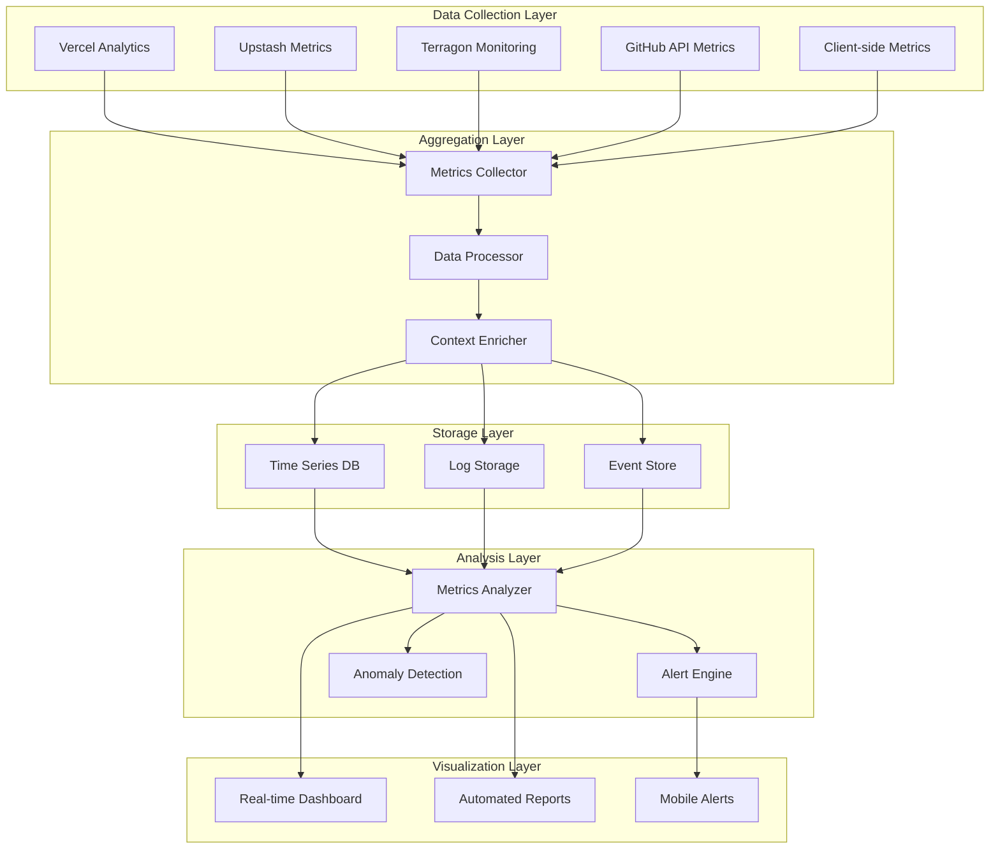

# Monitoring & Observability Architecture

## Overview

Comprehensive monitoring and observability strategy for the serverless Claude CLI Web UI, providing real-time insights into system performance, user behavior, cost optimization, and operational health across all components.

## Observability Philosophy

### Three Pillars of Observability
1. **Metrics**: Quantitative measurements of system behavior
2. **Logs**: Event records providing detailed context
3. **Traces**: Request flow through distributed systems

### Design Principles
- **Proactive vs Reactive**: Predict issues before they impact users
- **User-Centric**: Focus on user experience metrics
- **Cost-Aware**: Monitor and optimize operational costs
- **Actionable**: Every alert must have a clear action plan
- **Context-Rich**: Correlate data across all system layers

## Monitoring Architecture



## Data Collection Strategy

### Client-Side Metrics
```typescript
// services/ClientMetrics.ts
export class ClientMetricsCollector {
  private metrics: MetricEvent[] = [];
  private batchTimer: NodeJS.Timeout | null = null;
  private sessionId: string;
  
  constructor() {
    this.sessionId = this.generateSessionId();
    this.initializeCollection();
  }

  // Performance Metrics
  trackPageLoad(page: string, loadTime: number): void {
    this.addMetric({
      type: 'performance',
      name: 'page_load',
      value: loadTime,
      tags: { page },
      timestamp: Date.now()
    });
  }

  trackAPICall(endpoint: string, duration: number, status: number): void {
    this.addMetric({
      type: 'api',
      name: 'request_duration',
      value: duration,
      tags: { endpoint, status: status.toString() },
      timestamp: Date.now()
    });
  }

  trackUserAction(action: string, context?: Record<string, any>): void {
    this.addMetric({
      type: 'user',
      name: 'action',
      value: 1,
      tags: { action, ...context },
      timestamp: Date.now()
    });
  }

  // Error Tracking
  trackError(error: Error, context?: Record<string, any>): void {
    this.addMetric({
      type: 'error',
      name: 'client_error',
      value: 1,
      tags: {
        message: error.message,
        stack: error.stack?.substring(0, 500),
        ...context
      },
      timestamp: Date.now()
    });
  }

  // Real-time Connection Metrics
  trackWebSocketEvent(event: string, latency?: number): void {
    this.addMetric({
      type: 'realtime',
      name: 'websocket_event',
      value: latency || 1,
      tags: { event },
      timestamp: Date.now()
    });
  }

  private addMetric(metric: MetricEvent): void {
    metric.session_id = this.sessionId;
    metric.user_agent = navigator.userAgent;
    metric.url = window.location.href;
    
    this.metrics.push(metric);
    this.scheduleBatch();
  }

  private scheduleBatch(): void {
    if (this.batchTimer) return;
    
    this.batchTimer = setTimeout(() => {
      this.sendBatch();
    }, 5000); // 5 second batching
  }

  private async sendBatch(): Promise<void> {
    if (this.metrics.length === 0) return;
    
    const batch = this.metrics.splice(0);
    this.batchTimer = null;
    
    try {
      await fetch('/api/metrics/client', {
        method: 'POST',
        headers: { 'Content-Type': 'application/json' },
        body: JSON.stringify({ metrics: batch })
      });
    } catch (error) {
      console.error('Failed to send metrics:', error);
      // Re-queue metrics for retry
      this.metrics.unshift(...batch);
    }
  }

  // Web Vitals Integration
  private initializeCollection(): void {
    // Core Web Vitals
    this.measureWebVitals();
    
    // Resource timing
    this.trackResourcePerformance();
    
    // Navigation timing
    this.trackNavigationPerformance();
    
    // User engagement
    this.trackUserEngagement();
  }

  private measureWebVitals(): void {
    // Largest Contentful Paint (LCP)
    new PerformanceObserver((list) => {
      for (const entry of list.getEntries()) {
        this.trackPageLoad('lcp', entry.startTime);
      }
    }).observe({ entryTypes: ['largest-contentful-paint'] });

    // First Input Delay (FID)
    new PerformanceObserver((list) => {
      for (const entry of list.getEntries()) {
        this.addMetric({
          type: 'performance',
          name: 'first_input_delay',
          value: entry.processingStart - entry.startTime,
          timestamp: Date.now()
        });
      }
    }).observe({ entryTypes: ['first-input'] });

    // Cumulative Layout Shift (CLS)
    let clsValue = 0;
    new PerformanceObserver((list) => {
      for (const entry of list.getEntries()) {
        if (!entry.hadRecentInput) {
          clsValue += entry.value;
        }
      }
      
      this.addMetric({
        type: 'performance',
        name: 'cumulative_layout_shift',
        value: clsValue,
        timestamp: Date.now()
      });
    }).observe({ entryTypes: ['layout-shift'] });
  }
}
```

### Server-Side Metrics
```typescript
// services/ServerMetrics.ts
export class ServerMetricsCollector {
  private redis: Redis;
  
  constructor() {
    this.redis = new Redis(process.env.UPSTASH_REDIS_REST_URL);
  }

  // API Performance Metrics
  async trackAPIPerformance(
    endpoint: string,
    method: string,
    duration: number,
    statusCode: number,
    userId?: string
  ): Promise<void> {
    const timestamp = Date.now();
    const metrics = [
      {
        name: 'api_request_duration',
        value: duration,
        tags: { endpoint, method, status: statusCode.toString() },
        timestamp
      },
      {
        name: 'api_request_count',
        value: 1,
        tags: { endpoint, method, status: statusCode.toString() },
        timestamp
      }
    ];

    if (userId) {
      metrics.forEach(m => m.tags.user_id = userId);
    }

    await this.batchSendMetrics(metrics);
  }

  // Database Operation Metrics
  async trackDatabaseOperation(
    operation: string,
    table: string,
    duration: number,
    rowsAffected?: number
  ): Promise<void> {
    await this.batchSendMetrics([
      {
        name: 'db_operation_duration',
        value: duration,
        tags: { operation, table },
        timestamp: Date.now()
      },
      {
        name: 'db_rows_affected',
        value: rowsAffected || 0,
        tags: { operation, table },
        timestamp: Date.now()
      }
    ]);
  }

  // Queue Metrics
  async trackQueueOperation(
    operation: string,
    queue: string,
    duration: number,
    success: boolean
  ): Promise<void> {
    await this.batchSendMetrics([
      {
        name: 'queue_operation_duration',
        value: duration,
        tags: { operation, queue, success: success.toString() },
        timestamp: Date.now()
      },
      {
        name: 'queue_operation_count',
        value: 1,
        tags: { operation, queue, success: success.toString() },
        timestamp: Date.now()
      }
    ]);
  }

  // Business Metrics
  async trackTaskExecution(
    taskId: string,
    type: string,
    priority: string,
    duration: number,
    success: boolean,
    cost: number
  ): Promise<void> {
    await this.batchSendMetrics([
      {
        name: 'task_execution_duration',
        value: duration,
        tags: { type, priority, success: success.toString() },
        timestamp: Date.now()
      },
      {
        name: 'task_execution_cost',
        value: cost,
        tags: { type, priority },
        timestamp: Date.now()
      },
      {
        name: 'task_execution_count',
        value: 1,
        tags: { type, priority, success: success.toString() },
        timestamp: Date.now()
      }
    ]);
  }

  private async batchSendMetrics(metrics: Metric[]): Promise<void> {
    const pipeline = this.redis.pipeline();
    
    metrics.forEach(metric => {
      const key = `metrics:${metric.name}:${this.getTimeWindow()}`;
      const value = JSON.stringify({
        ...metric,
        hostname: process.env.VERCEL_REGION || 'local'
      });
      
      pipeline.lpush(key, value);
      pipeline.expire(key, 86400); // 24 hours
    });
    
    await pipeline.exec();
  }

  private getTimeWindow(): string {
    const now = new Date();
    return `${now.getFullYear()}-${now.getMonth() + 1}-${now.getDate()}-${now.getHours()}`;
  }
}
```

### External Service Monitoring
```typescript
// services/ExternalServiceMonitor.ts
export class ExternalServiceMonitor {
  private services = {
    github: 'https://api.github.com',
    upstash: 'https://upstash.com',
    terragon: process.env.TERRAGON_BASE_URL,
    vercel: 'https://api.vercel.com'
  };

  async monitorServiceHealth(): Promise<ServiceHealthStatus[]> {
    const healthChecks = Object.entries(this.services).map(
      async ([name, url]) => {
        try {
          const start = Date.now();
          const response = await fetch(`${url}/health`, {
            method: 'GET',
            timeout: 5000
          });
          const duration = Date.now() - start;
          
          return {
            service: name,
            status: response.ok ? 'healthy' : 'unhealthy',
            responseTime: duration,
            statusCode: response.status,
            timestamp: Date.now()
          };
        } catch (error) {
          return {
            service: name,
            status: 'unhealthy',
            responseTime: -1,
            error: error.message,
            timestamp: Date.now()
          };
        }
      }
    );

    const results = await Promise.all(healthChecks);
    
    // Store health check results
    await this.storeHealthResults(results);
    
    // Alert on unhealthy services
    await this.checkHealthAlerts(results);
    
    return results;
  }

  private async storeHealthResults(results: ServiceHealthStatus[]): Promise<void> {
    const redis = new Redis(process.env.UPSTASH_REDIS_REST_URL);
    const pipeline = redis.pipeline();
    
    results.forEach(result => {
      const key = `health:${result.service}`;
      pipeline.lpush(key, JSON.stringify(result));
      pipeline.ltrim(key, 0, 99); // Keep last 100 checks
      pipeline.expire(key, 86400);
    });
    
    await pipeline.exec();
  }

  private async checkHealthAlerts(results: ServiceHealthStatus[]): Promise<void> {
    const unhealthyServices = results.filter(r => r.status === 'unhealthy');
    
    if (unhealthyServices.length > 0) {
      await this.sendHealthAlert(unhealthyServices);
    }
  }
}
```

## Real-time Dashboard

### Dashboard Components
```typescript
// components/MonitoringDashboard.tsx
export function MonitoringDashboard() {
  const [metrics, setMetrics] = useState<DashboardMetrics | null>(null);
  const [alerts, setAlerts] = useState<Alert[]>([]);

  useEffect(() => {
    // Real-time metrics via Server-Sent Events
    const eventSource = new EventSource('/api/metrics/stream');
    
    eventSource.onmessage = (event) => {
      const data = JSON.parse(event.data);
      
      switch (data.type) {
        case 'metrics_update':
          setMetrics(data.metrics);
          break;
        case 'alert':
          setAlerts(prev => [data.alert, ...prev.slice(0, 9)]);
          break;
      }
    };

    return () => eventSource.close();
  }, []);

  return (
    <div className="monitoring-dashboard">
      <div className="dashboard-header">
        <h1>System Health Dashboard</h1>
        <div className="system-status">
          <SystemStatus metrics={metrics} />
        </div>
      </div>

      <div className="dashboard-grid">
        {/* Real-time Metrics */}
        <div className="metric-panel">
          <h3>API Performance</h3>
          <APIMetricsChart data={metrics?.api} />
        </div>

        <div className="metric-panel">
          <h3>Task Execution</h3>
          <TaskMetricsChart data={metrics?.tasks} />
        </div>

        <div className="metric-panel">
          <h3>Queue Status</h3>
          <QueueStatusChart data={metrics?.queue} />
        </div>

        <div className="metric-panel">
          <h3>Cost Tracking</h3>
          <CostChart data={metrics?.costs} />
        </div>

        {/* Service Health */}
        <div className="service-panel">
          <h3>Service Health</h3>
          <ServiceHealthGrid services={metrics?.services} />
        </div>

        {/* Recent Alerts */}
        <div className="alerts-panel">
          <h3>Recent Alerts</h3>
          <AlertsList alerts={alerts} />
        </div>

        {/* User Activity */}
        <div className="activity-panel">
          <h3>User Activity</h3>
          <UserActivityChart data={metrics?.users} />
        </div>

        {/* Performance Trends */}
        <div className="trends-panel">
          <h3>Performance Trends</h3>
          <PerformanceTrendsChart data={metrics?.trends} />
        </div>
      </div>
    </div>
  );
}

function SystemStatus({ metrics }: { metrics: DashboardMetrics | null }) {
  if (!metrics) return <div className="status loading">Loading...</div>;

  const overallHealth = calculateOverallHealth(metrics);
  const statusClass = `status ${overallHealth.status}`;

  return (
    <div className={statusClass}>
      <div className="status-indicator"></div>
      <span>{overallHealth.message}</span>
    </div>
  );
}
```

### Metrics Visualization
```typescript
// components/MetricsCharts.tsx
export function APIMetricsChart({ data }: { data: APIMetrics }) {
  const chartData = useMemo(() => ({
    labels: data?.timeline.map(t => new Date(t.timestamp).toLocaleTimeString()) || [],
    datasets: [
      {
        label: 'Response Time (ms)',
        data: data?.timeline.map(t => t.responseTime) || [],
        borderColor: 'rgb(75, 192, 192)',
        backgroundColor: 'rgba(75, 192, 192, 0.2)'
      },
      {
        label: 'Request Count',
        data: data?.timeline.map(t => t.requestCount) || [],
        borderColor: 'rgb(255, 99, 132)',
        backgroundColor: 'rgba(255, 99, 132, 0.2)',
        yAxisID: 'y1'
      }
    ]
  }), [data]);

  const options = {
    responsive: true,
    plugins: {
      legend: { position: 'top' as const },
      title: { display: true, text: 'API Performance' }
    },
    scales: {
      y: {
        type: 'linear' as const,
        display: true,
        position: 'left' as const,
        title: { display: true, text: 'Response Time (ms)' }
      },
      y1: {
        type: 'linear' as const,
        display: true,
        position: 'right' as const,
        title: { display: true, text: 'Request Count' },
        grid: { drawOnChartArea: false }
      }
    }
  };

  return <Line data={chartData} options={options} />;
}

export function TaskMetricsChart({ data }: { data: TaskMetrics }) {
  const chartData = useMemo(() => ({
    labels: ['Pending', 'Running', 'Completed', 'Failed'],
    datasets: [{
      data: [
        data?.pending || 0,
        data?.running || 0,
        data?.completed || 0,
        data?.failed || 0
      ],
      backgroundColor: ['#fbbf24', '#3b82f6', '#10b981', '#ef4444']
    }]
  }), [data]);

  return <Doughnut data={chartData} />;
}
```

## Alerting System

### Alert Rules Engine
```typescript
// services/AlertEngine.ts
export class AlertEngine {
  private rules: AlertRule[] = [];
  private redis: Redis;
  
  constructor() {
    this.redis = new Redis(process.env.UPSTASH_REDIS_REST_URL);
    this.initializeRules();
  }

  private initializeRules(): void {
    this.rules = [
      // Performance Alerts
      {
        id: 'high_response_time',
        name: 'High API Response Time',
        condition: (metrics) => metrics.api.avgResponseTime > 1000,
        severity: 'warning',
        cooldown: 300000, // 5 minutes
        action: this.sendPerformanceAlert
      },
      {
        id: 'error_rate_spike',
        name: 'Error Rate Spike',
        condition: (metrics) => metrics.api.errorRate > 0.05,
        severity: 'critical',
        cooldown: 60000, // 1 minute
        action: this.sendErrorAlert
      },
      
      // Queue Alerts
      {
        id: 'queue_backlog',
        name: 'Queue Backlog High',
        condition: (metrics) => metrics.queue.totalSize > 100,
        severity: 'warning',
        cooldown: 600000, // 10 minutes
        action: this.sendQueueAlert
      },
      
      // Cost Alerts
      {
        id: 'daily_cost_limit',
        name: 'Daily Cost Limit Exceeded',
        condition: (metrics) => metrics.costs.dailySpend > 50,
        severity: 'warning',
        cooldown: 3600000, // 1 hour
        action: this.sendCostAlert
      },
      
      // Service Health Alerts
      {
        id: 'service_unhealthy',
        name: 'External Service Unhealthy',
        condition: (metrics) => metrics.services.some(s => s.status === 'unhealthy'),
        severity: 'critical',
        cooldown: 300000, // 5 minutes
        action: this.sendServiceAlert
      }
    ];
  }

  async evaluateRules(metrics: SystemMetrics): Promise<void> {
    for (const rule of this.rules) {
      try {
        if (rule.condition(metrics)) {
          await this.triggerAlert(rule, metrics);
        }
      } catch (error) {
        console.error(`Error evaluating rule ${rule.id}:`, error);
      }
    }
  }

  private async triggerAlert(rule: AlertRule, metrics: SystemMetrics): Promise<void> {
    const cooldownKey = `alert_cooldown:${rule.id}`;
    const isInCooldown = await this.redis.get(cooldownKey);
    
    if (isInCooldown) {
      return; // Alert is in cooldown period
    }

    // Set cooldown
    await this.redis.setex(cooldownKey, rule.cooldown / 1000, '1');
    
    // Create alert
    const alert: Alert = {
      id: `alert_${Date.now()}_${rule.id}`,
      ruleId: rule.id,
      name: rule.name,
      severity: rule.severity,
      message: this.generateAlertMessage(rule, metrics),
      timestamp: Date.now(),
      resolved: false,
      metrics: this.extractRelevantMetrics(rule, metrics)
    };

    // Store alert
    await this.storeAlert(alert);
    
    // Execute alert action
    await rule.action(alert, metrics);
    
    // Publish alert event
    await this.publishAlertEvent(alert);
  }

  private async sendPerformanceAlert(alert: Alert, metrics: SystemMetrics): Promise<void> {
    const message = `🚨 Performance Alert: ${alert.name}\n\nCurrent avg response time: ${metrics.api.avgResponseTime}ms\nThreshold: 1000ms\n\nTime: ${new Date().toISOString()}`;
    
    await this.sendNotification('performance', message, alert.severity);
  }

  private async sendErrorAlert(alert: Alert, metrics: SystemMetrics): Promise<void> {
    const message = `🔥 Critical: ${alert.name}\n\nCurrent error rate: ${(metrics.api.errorRate * 100).toFixed(2)}%\nThreshold: 5%\n\nImmediate action required!`;
    
    await this.sendNotification('errors', message, 'critical');
  }

  private async sendCostAlert(alert: Alert, metrics: SystemMetrics): Promise<void> {
    const message = `💰 Cost Alert: ${alert.name}\n\nDaily spend: $${metrics.costs.dailySpend.toFixed(2)}\nBudget: $50.00\n\nConsider optimizing resource usage.`;
    
    await this.sendNotification('costs', message, 'warning');
  }

  private async sendNotification(
    channel: string,
    message: string,
    severity: AlertSeverity
  ): Promise<void> {
    const notifications = [
      // Slack notification
      this.sendSlackNotification(channel, message, severity),
      
      // Email notification (for critical alerts)
      severity === 'critical' ? this.sendEmailNotification(message) : Promise.resolve(),
      
      // SMS notification (for critical alerts)
      severity === 'critical' ? this.sendSMSNotification(message) : Promise.resolve(),
      
      // Push notification to dashboard users
      this.sendPushNotification(message, severity)
    ];

    await Promise.allSettled(notifications);
  }
}
```

### Notification Channels
```typescript
// services/NotificationService.ts
export class NotificationService {
  async sendSlackNotification(
    channel: string,
    message: string,
    severity: AlertSeverity
  ): Promise<void> {
    const webhookUrl = process.env.SLACK_WEBHOOK_URL;
    if (!webhookUrl) return;

    const color = {
      info: '#36a3eb',
      warning: '#ffcd56', 
      critical: '#ff6384'
    }[severity];

    const payload = {
      channel: `#${channel}`,
      username: 'Claude CLI Monitor',
      icon_emoji: ':robot_face:',
      attachments: [{
        color,
        text: message,
        ts: Math.floor(Date.now() / 1000)
      }]
    };

    try {
      await fetch(webhookUrl, {
        method: 'POST',
        headers: { 'Content-Type': 'application/json' },
        body: JSON.stringify(payload)
      });
    } catch (error) {
      console.error('Failed to send Slack notification:', error);
    }
  }

  async sendEmailNotification(message: string): Promise<void> {
    // Implement email notification via SendGrid, SES, etc.
    const emailData = {
      to: process.env.ALERT_EMAIL,
      subject: 'Claude CLI Critical Alert',
      text: message,
      html: this.formatHTMLEmail(message)
    };

    // Send email implementation
  }

  async sendPushNotification(message: string, severity: AlertSeverity): Promise<void> {
    // Publish to real-time channels for dashboard users
    const pubsub = new RedisPubSubService();
    await pubsub.publishEvent('alerts', {
      type: 'alert',
      message,
      severity,
      timestamp: Date.now()
    });
  }
}
```

## Log Management

### Structured Logging
```typescript
// services/LoggingService.ts
export class StructuredLogger {
  private context: LogContext;
  
  constructor(context: LogContext = {}) {
    this.context = context;
  }

  info(message: string, data?: any): void {
    this.log('info', message, data);
  }

  warn(message: string, data?: any): void {
    this.log('warn', message, data);
  }

  error(message: string, error?: Error, data?: any): void {
    this.log('error', message, { error: error?.message, stack: error?.stack, ...data });
  }

  private log(level: LogLevel, message: string, data?: any): void {
    const logEntry: LogEntry = {
      timestamp: new Date().toISOString(),
      level,
      message,
      data,
      context: this.context,
      hostname: process.env.VERCEL_REGION || 'local',
      service: 'claude-cli-web-ui'
    };

    // Console output (for Vercel logs)
    console.log(JSON.stringify(logEntry));
    
    // Store in Redis for aggregation
    this.storeLog(logEntry);
  }

  private async storeLog(entry: LogEntry): Promise<void> {
    const redis = new Redis(process.env.UPSTASH_REDIS_REST_URL);
    const key = `logs:${entry.level}:${this.getDateKey()}`;
    
    await redis.lpush(key, JSON.stringify(entry));
    await redis.expire(key, 604800); // 7 days
  }

  private getDateKey(): string {
    const now = new Date();
    return `${now.getFullYear()}-${now.getMonth() + 1}-${now.getDate()}`;
  }
}
```

## Performance Analytics

### User Experience Metrics
```typescript
// services/UXMetrics.ts
export class UXMetricsCollector {
  async collectUserExperienceMetrics(): Promise<UXMetrics> {
    const redis = new Redis(process.env.UPSTASH_REDIS_REST_URL);
    
    // Core Web Vitals
    const webVitals = await this.getWebVitals();
    
    // User Journey Analytics
    const journeys = await this.analyzeUserJourneys();
    
    // Feature Usage Analytics
    const featureUsage = await this.getFeatureUsage();
    
    // Error Impact Analysis
    const errorImpact = await this.analyzeErrorImpact();

    return {
      webVitals,
      journeys,
      featureUsage,
      errorImpact,
      timestamp: Date.now()
    };
  }

  private async getWebVitals(): Promise<WebVitals> {
    const redis = new Redis(process.env.UPSTASH_REDIS_REST_URL);
    const vitalsData = await redis.lrange('metrics:web_vitals', 0, 999);
    
    const vitals = vitalsData.map(d => JSON.parse(d));
    
    return {
      lcp: this.calculatePercentile(vitals.filter(v => v.name === 'lcp'), 75),
      fid: this.calculatePercentile(vitals.filter(v => v.name === 'fid'), 75),
      cls: this.calculatePercentile(vitals.filter(v => v.name === 'cls'), 75),
      scores: this.calculateWebVitalScores(vitals)
    };
  }

  private async analyzeUserJourneys(): Promise<UserJourney[]> {
    // Analyze common user paths through the application
    const redis = new Redis(process.env.UPSTASH_REDIS_REST_URL);
    const navigationData = await redis.lrange('metrics:navigation', 0, 9999);
    
    const journeys = this.groupNavigationPaths(navigationData);
    
    return journeys.map(journey => ({
      path: journey.path,
      count: journey.count,
      avgDuration: journey.totalDuration / journey.count,
      conversionRate: journey.completions / journey.count,
      dropoffPoints: journey.dropoffPoints
    }));
  }

  private calculateWebVitalScores(vitals: any[]): WebVitalScores {
    // Google's Core Web Vitals scoring
    const lcpScore = this.scoreMetric(vitals.filter(v => v.name === 'lcp'), 2500, 4000);
    const fidScore = this.scoreMetric(vitals.filter(v => v.name === 'fid'), 100, 300);
    const clsScore = this.scoreMetric(vitals.filter(v => v.name === 'cls'), 0.1, 0.25);
    
    return {
      lcp: lcpScore,
      fid: fidScore,
      cls: clsScore,
      overall: (lcpScore + fidScore + clsScore) / 3
    };
  }
}
```

## Automated Reporting

### Daily Health Reports
```typescript
// services/ReportingService.ts
export class AutomatedReporting {
  async generateDailyReport(): Promise<DailyReport> {
    const endTime = Date.now();
    const startTime = endTime - (24 * 60 * 60 * 1000); // 24 hours ago

    const [
      systemMetrics,
      performanceMetrics,
      costMetrics,
      errorMetrics,
      userMetrics
    ] = await Promise.all([
      this.getSystemMetrics(startTime, endTime),
      this.getPerformanceMetrics(startTime, endTime),
      this.getCostMetrics(startTime, endTime),
      this.getErrorMetrics(startTime, endTime),
      this.getUserMetrics(startTime, endTime)
    ]);

    const report: DailyReport = {
      date: new Date().toISOString().split('T')[0],
      summary: this.generateSummary(systemMetrics),
      performance: performanceMetrics,
      costs: costMetrics,
      errors: errorMetrics,
      users: userMetrics,
      recommendations: this.generateRecommendations({
        systemMetrics,
        performanceMetrics,
        costMetrics,
        errorMetrics
      })
    };

    // Store report
    await this.storeReport(report);
    
    // Send report notifications
    await this.sendReportNotifications(report);

    return report;
  }

  private generateRecommendations(data: any): Recommendation[] {
    const recommendations: Recommendation[] = [];

    // Performance recommendations
    if (data.performanceMetrics.avgResponseTime > 500) {
      recommendations.push({
        type: 'performance',
        priority: 'medium',
        title: 'Optimize API Response Times',
        description: 'Average response time is above 500ms. Consider implementing caching or optimizing database queries.',
        impact: 'Improved user experience and reduced server costs'
      });
    }

    // Cost recommendations
    if (data.costMetrics.dailySpend > data.costMetrics.budget * 0.8) {
      recommendations.push({
        type: 'cost',
        priority: 'high',
        title: 'Cost Optimization Required',
        description: 'Daily spending is approaching budget limits. Review resource usage and optimize expensive operations.',
        impact: 'Prevent budget overruns and reduce operational costs'
      });
    }

    // Error recommendations
    if (data.errorMetrics.errorRate > 0.01) {
      recommendations.push({
        type: 'reliability',
        priority: 'high',
        title: 'Address Error Rate',
        description: 'Error rate is above 1%. Investigate and fix recurring errors to improve system reliability.',
        impact: 'Better user experience and reduced support burden'
      });
    }

    return recommendations;
  }

  private async sendReportNotifications(report: DailyReport): Promise<void> {
    const summary = this.formatReportSummary(report);
    
    // Send to Slack
    await this.sendSlackReport(summary);
    
    // Send email to stakeholders
    await this.sendEmailReport(report);
    
    // Update dashboard
    await this.updateDashboardReport(report);
  }
}
```

This comprehensive monitoring and observability architecture provides real-time insights, proactive alerting, and automated reporting to ensure optimal system performance and user experience.