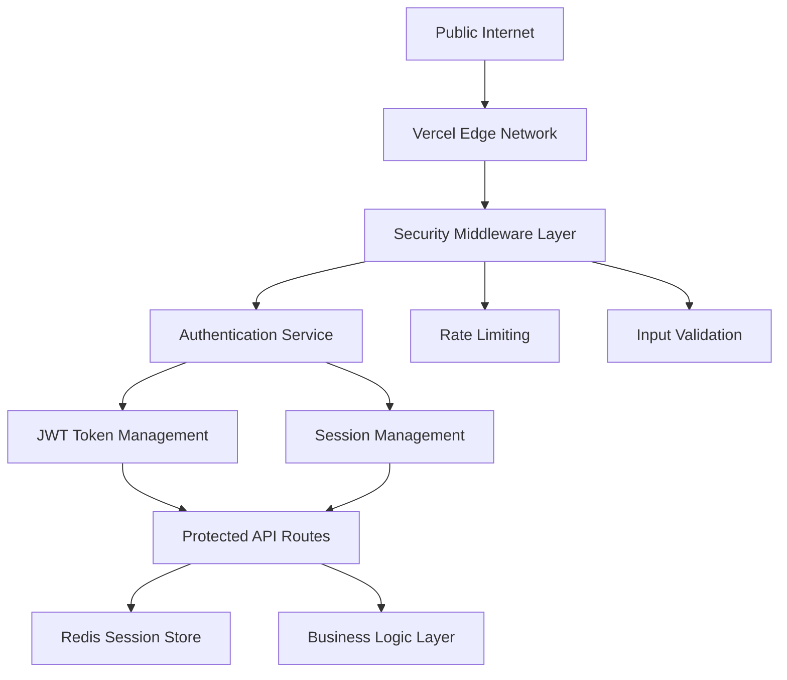

# Secure Authentication Architecture for Public Access

## ARCHITECTURE OVERVIEW

### 1. Multi-Layer Security Model



### 2. Authentication Flow Design

#### Public Access with Optional Authentication
```typescript
// Authentication Strategy
interface AuthStrategy {
  publicRoutes: string[];      // No auth required
  protectedRoutes: string[];   // Auth required
  adminRoutes: string[];       // Admin auth required
  guestAccess: boolean;        // Allow guest browsing
}

const authStrategy: AuthStrategy = {
  publicRoutes: ['/login', '/register', '/public/*'],
  protectedRoutes: ['/dashboard/*', '/tasks/*', '/projects/*'],
  adminRoutes: ['/admin/*', '/system/*'],
  guestAccess: true
};
```

### 3. Security Configuration

#### CORS Policy (Restrictive)
```json
{
  "headers": [
    {
      "source": "/api/(.*)",
      "headers": [
        {
          "key": "Access-Control-Allow-Origin",
          "value": "https://claude-cli-web-ui.vercel.app"
        },
        {
          "key": "Access-Control-Allow-Credentials",
          "value": "true"
        },
        {
          "key": "X-Content-Type-Options",
          "value": "nosniff"
        },
        {
          "key": "X-Frame-Options",
          "value": "DENY"
        },
        {
          "key": "X-XSS-Protection",
          "value": "1; mode=block"
        }
      ]
    }
  ]
}
```

### 4. Environment-Specific Access Control

#### Production Security Model
- **Guest Access**: Read-only browsing of public content
- **Authenticated Users**: Full application access
- **Admin Users**: System administration
- **API Access**: JWT-based authentication required

#### Security Headers Implementation
```typescript
// Security middleware
export const securityHeaders = {
  'Strict-Transport-Security': 'max-age=31536000; includeSubDomains',
  'Content-Security-Policy': "default-src 'self'; script-src 'self' 'unsafe-inline'",
  'X-Content-Type-Options': 'nosniff',
  'X-Frame-Options': 'DENY',
  'X-XSS-Protection': '1; mode=block',
  'Referrer-Policy': 'strict-origin-when-cross-origin'
};
```

### 5. Cost-Optimized Infrastructure

#### Vercel + Upstash Architecture
- **Frontend**: Vercel Edge deployment ($0/month for hobby)
- **Backend**: Vercel Functions (pay-per-invocation)
- **Database**: Upstash Redis (10k requests/month free)
- **Authentication**: Built-in JWT (no external service cost)

#### Estimated Monthly Cost: $0-25
- Vercel Pro: $20/month (if needed for team features)
- Upstash Redis: $0-5/month (based on usage)
- No additional authentication service costs

### 6. Deployment Strategy

#### Single-Domain Deployment
```bash
# Deploy both frontend and backend to single Vercel project
npx vercel --prod

# Configure custom domain (optional)
npx vercel domains add your-domain.com
```

#### Environment Variable Management
```bash
# Production secrets (managed via Vercel CLI)
npx vercel secrets add prod-jwt-secret "$(openssl rand -hex 32)"
npx vercel secrets add prod-github-token "your-token"
npx vercel secrets add prod-redis-token "your-redis-token"

# Environment-specific variables
npx vercel env add ENABLE_GUEST_ACCESS Production true
npx vercel env add ENABLE_PUBLIC_ROUTES Production true
```

## IMPLEMENTATION PRIORITY

1. **CRITICAL**: Disable Vercel account protection (immediate)
2. **HIGH**: Implement secure environment variable management
3. **HIGH**: Update CORS and security headers
4. **MEDIUM**: Implement guest access functionality
5. **LOW**: Custom domain configuration

## SECURITY COMPLIANCE

### Public Access Requirements
- Rate limiting: 100 requests/minute per IP
- Input validation on all endpoints
- XSS and CSRF protection
- Secure session management
- Audit logging for admin actions

### Data Protection
- Encrypt sensitive data at rest
- Use HTTPS only (enforced by Vercel)
- Implement proper session timeout
- Regular security audit logging