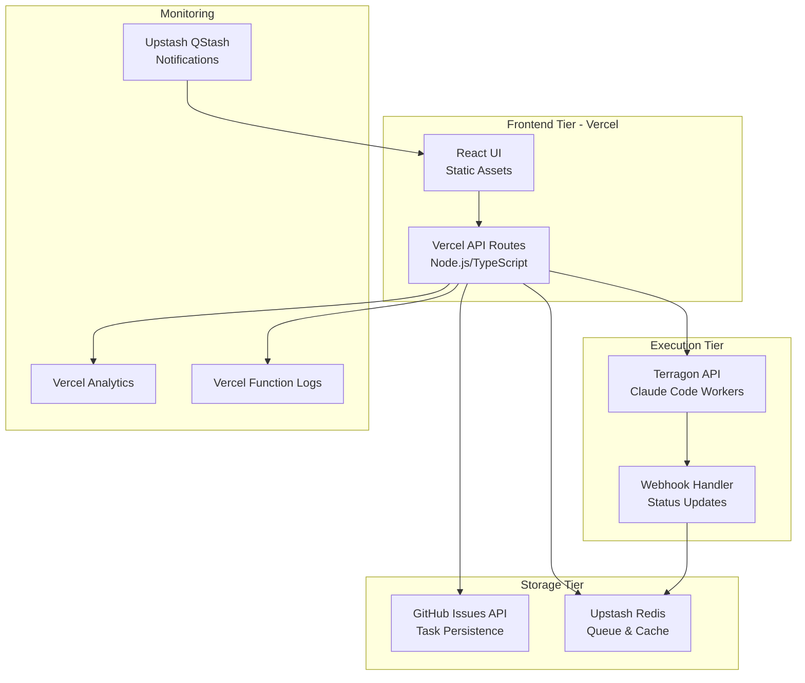

# Claude CLI Web UI - Serverless Architecture Design

## Executive Summary

Complete migration from local FastAPI/React setup to production-ready serverless architecture using Vercel, GitHub Issues, Upstash Redis, and Terragon API integration for scalable Claude Code execution.

## Current State Analysis

### Existing System (Production-Ready)
- **Backend**: FastAPI (12,680 lines) with secure JWT auth, command injection protection
- **Frontend**: React TypeScript (13,895 lines) with comprehensive task management UI
- **Database**: SQLite with async support
- **Security**: Production-ready with rate limiting, CORS, comprehensive input validation
- **Features**: 36 API endpoints, WebSocket support, session management, role-based auth

### Quality Assessment
- **Code Quality**: High (comprehensive test coverage, type safety)
- **Security**: Production-ready (vulnerabilities remediated)
- **Architecture**: Well-structured but monolithic

## Target Serverless Architecture

### Overview


## Component Architecture

### 1. Frontend Layer - Vercel Static Hosting

**Technology**: React 18 + TypeScript + Tailwind CSS
**Hosting**: Vercel Edge Network (Global CDN)

```typescript
// vercel.json
{
  "framework": "vite",
  "buildCommand": "npm run build",
  "outputDirectory": "dist",
  "routes": [
    {
      "src": "/api/(.*)",
      "dest": "/api/$1"
    },
    {
      "src": "/(.*)",
      "dest": "/index.html"
    }
  ]
}
```

**Key Features**:
- Server-Side Generation (SSG) for static pages
- Edge caching with automatic invalidation
- Real-time updates via Server-Sent Events
- Progressive Web App (PWA) capabilities

### 2. API Layer - Vercel Serverless Functions

**Technology**: Node.js 18 + TypeScript
**Runtime**: Vercel Serverless Functions (AWS Lambda under the hood)

```typescript
// api/tasks/[id].ts
import { NextRequest, NextResponse } from 'next/server';
import { GitHubService } from '../services/github';
import { RedisService } from '../services/redis';

export async function GET(
  request: NextRequest,
  { params }: { params: { id: string } }
) {
  const task = await GitHubService.getTask(params.id);
  return NextResponse.json(task);
}
```

**Function Structure**:
```
api/
├── auth/
│   ├── login.ts
│   ├── refresh.ts
│   └── validate.ts
├── tasks/
│   ├── index.ts
│   ├── [id].ts
│   └── queue.ts
├── projects/
│   ├── index.ts
│   └── [id].ts
├── terragon/
│   ├── execute.ts
│   ├── status.ts
│   └── webhook.ts
└── sse/
    └── events.ts
```

### 3. Task Persistence - GitHub Issues API

**Purpose**: Durable task storage with built-in audit trail
**Benefits**: 
- Free tier: 60,000 API requests/hour
- Native version control and collaboration
- Automatic backup and disaster recovery
- Rich metadata and labeling system

```typescript
// services/github.ts
export class GitHubService {
  private octokit: Octokit;
  
  async createTask(task: TaskCreate): Promise<Task> {
    const issue = await this.octokit.rest.issues.create({
      owner: 'your-org',
      repo: 'claude-tasks',
      title: task.title,
      body: JSON.stringify(task),
      labels: ['status:pending', `priority:${task.priority}`]
    });
    
    return this.mapIssueToTask(issue.data);
  }
  
  async updateTaskStatus(id: string, status: TaskStatus): Promise<void> {
    await this.octokit.rest.issues.update({
      owner: 'your-org',
      repo: 'claude-tasks',
      issue_number: parseInt(id),
      labels: [`status:${status}`]
    });
  }
}
```

**Schema Mapping**:
```typescript
interface GitHubTaskMapping {
  // GitHub Issue -> Task
  id: number;           // issue.number
  title: string;        // issue.title
  description: string;  // issue.body (JSON parsed)
  status: TaskStatus;   // labels: status:*
  priority: Priority;   // labels: priority:*
  assignee: string;     // issue.assignee.login
  created_at: string;   // issue.created_at
  updated_at: string;   // issue.updated_at
}
```

### 4. Queue Management - Upstash Redis

**Purpose**: Real-time task queuing and caching
**Benefits**:
- Serverless-native Redis
- Per-request pricing model
- Built-in REST API
- Geographic distribution

```typescript
// services/redis.ts
export class RedisQueueService {
  private redis: Redis;
  
  async enqueueTask(task: Task): Promise<void> {
    const queueKey = `queue:${task.priority}`;
    await this.redis.lpush(queueKey, JSON.stringify(task));
    await this.redis.publish('task:created', task.id);
  }
  
  async dequeueTask(priority: Priority): Promise<Task | null> {
    const queueKey = `queue:${priority}`;
    const taskData = await this.redis.brpop(queueKey, 1);
    return taskData ? JSON.parse(taskData[1]) : null;
  }
  
  async cacheTaskResult(taskId: string, result: any): Promise<void> {
    await this.redis.setex(`result:${taskId}`, 3600, JSON.stringify(result));
  }
}
```

**Queue Architecture**:
```
Redis Streams & Lists:
├── queue:high     (High priority tasks)
├── queue:medium   (Medium priority tasks)
├── queue:low      (Low priority tasks)
├── cache:results  (Task execution results)
├── cache:sessions (User sessions)
└── pubsub:events  (Real-time notifications)
```

### 5. Worker Execution - Terragon API Integration

**Purpose**: Scalable Claude Code execution in isolated environments
**Benefits**:
- Pay-per-execution model
- Automatic scaling
- Isolated execution environments
- Built-in monitoring

```typescript
// services/terragon.ts
export class TerragonService {
  private apiKey: string;
  private baseUrl: string;
  
  async executeTask(task: Task): Promise<ExecutionResult> {
    const response = await fetch(`${this.baseUrl}/execute`, {
      method: 'POST',
      headers: {
        'Authorization': `Bearer ${this.apiKey}`,
        'Content-Type': 'application/json'
      },
      body: JSON.stringify({
        command: task.command,
        environment: task.environment,
        timeout: task.timeout || 300,
        webhook_url: `${process.env.VERCEL_URL}/api/terragon/webhook`
      })
    });
    
    return response.json();
  }
  
  async getExecutionStatus(executionId: string): Promise<ExecutionStatus> {
    const response = await fetch(`${this.baseUrl}/executions/${executionId}`, {
      headers: { 'Authorization': `Bearer ${this.apiKey}` }
    });
    
    return response.json();
  }
}
```

### 6. Real-time Communication - Server-Sent Events

**Purpose**: Real-time updates without WebSocket complexity
**Benefits**:
- Simpler than WebSocket in serverless
- Automatic reconnection
- HTTP/2 compatible
- Better for serverless functions

```typescript
// api/sse/events.ts
export async function GET(request: NextRequest) {
  const { searchParams } = new URL(request.url);
  const userId = searchParams.get('userId');
  
  const stream = new ReadableStream({
    start(controller) {
      const encoder = new TextEncoder();
      
      // Subscribe to Redis pub/sub for user events
      const redis = new Redis(process.env.UPSTASH_REDIS_REST_URL);
      
      const sendEvent = (data: any) => {
        const message = `data: ${JSON.stringify(data)}\n\n`;
        controller.enqueue(encoder.encode(message));
      };
      
      // Send initial connection event
      sendEvent({ type: 'connected', timestamp: Date.now() });
      
      // Set up Redis subscription
      redis.subscribe(`user:${userId}:events`, (message) => {
        sendEvent(JSON.parse(message));
      });
    }
  });
  
  return new Response(stream, {
    headers: {
      'Content-Type': 'text/event-stream',
      'Cache-Control': 'no-cache',
      'Connection': 'keep-alive'
    }
  });
}
```

## Migration Strategy

### Phase 1: Infrastructure Setup (Week 1)
1. **Vercel Project Setup**
   - Deploy current React frontend to Vercel
   - Configure custom domain and SSL
   - Set up environment variables

2. **GitHub Repository Setup**
   - Create dedicated task repository
   - Configure GitHub App for API access
   - Set up webhook endpoints

3. **Upstash Redis Setup**
   - Provision Upstash Redis instance
   - Configure connection strings
   - Test basic operations

### Phase 2: API Migration (Week 2)
1. **Convert FastAPI to Vercel Functions**
   - Migrate authentication endpoints
   - Convert task management APIs
   - Implement GitHub Issues integration

2. **Real-time Communication**
   - Replace WebSocket with Server-Sent Events
   - Implement Redis pub/sub for notifications
   - Test real-time updates

### Phase 3: Terragon Integration (Week 3)
1. **Worker Integration**
   - Implement Terragon API client
   - Set up webhook handlers
   - Configure execution environments

2. **Queue Management**
   - Implement task queueing logic
   - Set up priority-based processing
   - Configure retry mechanisms

### Phase 4: Testing & Optimization (Week 4)
1. **Comprehensive Testing**
   - End-to-end functionality tests
   - Performance testing
   - Security validation

2. **Performance Optimization**
   - Function cold start optimization
   - Caching strategies
   - Database query optimization

## Cost Analysis & Optimization

### Monthly Cost Breakdown (Estimated)

**Vercel Pro Plan**: $20/month
- 100GB bandwidth
- 1000 serverless function executions
- Advanced analytics
- Custom domains

**GitHub Issues API**: FREE
- 60,000 requests/hour
- 5000 requests/hour authenticated
- Unlimited private repositories

**Upstash Redis**: $0-50/month
- Pay-per-request pricing
- 10,000 requests/day free tier
- Additional: $0.2 per 100k requests

**Terragon API**: Variable
- Pay-per-execution model
- Estimated $0.01-0.10 per task execution
- Depends on execution complexity

**Total Estimated Monthly Cost**: $20-100/month
(vs. $200-500/month for equivalent traditional hosting)

### Cost Optimization Strategies

1. **Function Optimization**
   - Use Edge Functions for simple operations
   - Implement efficient caching
   - Optimize bundle sizes

2. **Request Optimization**
   - Batch GitHub API requests
   - Implement intelligent caching
   - Use webhooks to reduce polling

3. **Resource Management**
   - Implement automatic scaling
   - Use appropriate function timeouts
   - Monitor and optimize cold starts

## Security Architecture

### Authentication & Authorization
```typescript
// api/middleware/auth.ts
export async function authenticateRequest(request: NextRequest): Promise<User | null> {
  const token = request.headers.get('Authorization')?.replace('Bearer ', '');
  
  if (!token) {
    return null;
  }
  
  try {
    const payload = jwt.verify(token, process.env.JWT_SECRET!);
    const user = await getUserById(payload.sub);
    return user;
  } catch (error) {
    return null;
  }
}
```

### Rate Limiting
```typescript
// api/middleware/rateLimit.ts
export async function rateLimit(request: NextRequest, limit: number = 100): Promise<boolean> {
  const ip = request.ip || 'unknown';
  const key = `rate_limit:${ip}`;
  
  const redis = new Redis(process.env.UPSTASH_REDIS_REST_URL);
  const current = await redis.incr(key);
  
  if (current === 1) {
    await redis.expire(key, 3600); // 1 hour window
  }
  
  return current <= limit;
}
```

### Input Validation
```typescript
// api/utils/validation.ts
export function validateCommand(command: string): ValidationResult {
  // Implement comprehensive command validation
  const dangerousPatterns = [
    /rm\s+-rf\s+\//,
    /sudo/,
    /curl.*\|\s*sh/,
    /eval\s*\(/
  ];
  
  for (const pattern of dangerousPatterns) {
    if (pattern.test(command)) {
      return { valid: false, reason: 'Potentially dangerous command' };
    }
  }
  
  return { valid: true };
}
```

## Monitoring & Observability

### Metrics Collection
```typescript
// api/utils/metrics.ts
export class MetricsCollector {
  static async recordFunctionExecution(
    functionName: string,
    duration: number,
    success: boolean
  ) {
    // Send to Vercel Analytics
    await fetch('https://api.vercel.com/v1/analytics', {
      method: 'POST',
      headers: {
        'Authorization': `Bearer ${process.env.VERCEL_TOKEN}`,
        'Content-Type': 'application/json'
      },
      body: JSON.stringify({
        name: `function.${functionName}`,
        value: duration,
        tags: { success: success.toString() }
      })
    });
  }
}
```

### Error Tracking
```typescript
// api/utils/errorTracking.ts
export class ErrorTracker {
  static async reportError(error: Error, context: any) {
    // Log to Vercel Function logs
    console.error('Function error:', {
      message: error.message,
      stack: error.stack,
      context,
      timestamp: new Date().toISOString()
    });
    
    // Send to external service if needed
    if (process.env.ERROR_TRACKING_URL) {
      await fetch(process.env.ERROR_TRACKING_URL, {
        method: 'POST',
        headers: { 'Content-Type': 'application/json' },
        body: JSON.stringify({ error: error.message, context })
      });
    }
  }
}
```

## Infrastructure as Code

### Terraform Configuration
```hcl
# terraform/main.tf
terraform {
  required_providers {
    vercel = {
      source  = "vercel/vercel"
      version = "~> 0.15"
    }
    github = {
      source  = "integrations/github"
      version = "~> 5.0"
    }
  }
}

resource "vercel_project" "claude_cli" {
  name      = "claude-cli-web-ui"
  framework = "vite"
  
  environment = [
    {
      key    = "GITHUB_TOKEN"
      value  = var.github_token
      target = ["production", "preview"]
    },
    {
      key    = "UPSTASH_REDIS_REST_URL"
      value  = var.redis_url
      target = ["production", "preview"]
    },
    {
      key    = "TERRAGON_API_KEY"
      value  = var.terragon_api_key
      target = ["production", "preview"]
    }
  ]
}

resource "github_repository" "tasks" {
  name        = "claude-tasks"
  description = "Task storage for Claude CLI Web UI"
  private     = true
  
  has_issues = true
  has_wiki   = false
}

resource "vercel_deployment" "production" {
  project_id = vercel_project.claude_cli.id
  files      = fileset(path.module, "../{api,public,src}/**")
  
  production = true
}
```

### Environment Configuration
```bash
# .env.production
NODE_ENV=production
VERCEL_URL=https://claude-cli.vercel.app

# Authentication
JWT_SECRET=your-super-secure-jwt-secret-here
JWT_EXPIRES_IN=7d

# GitHub Integration
GITHUB_TOKEN=ghp_your_github_token_here
GITHUB_OWNER=your-github-username
GITHUB_REPO=claude-tasks

# Upstash Redis
UPSTASH_REDIS_REST_URL=https://your-redis-instance.upstash.io
UPSTASH_REDIS_REST_TOKEN=your-redis-token

# Terragon API
TERRAGON_API_KEY=your-terragon-api-key
TERRAGON_BASE_URL=https://api.terragon.ai

# Monitoring
VERCEL_TOKEN=your-vercel-token
ERROR_TRACKING_URL=optional-error-tracking-service
```

## Deployment Pipeline

### GitHub Actions Workflow
```yaml
# .github/workflows/deploy.yml
name: Deploy to Vercel

on:
  push:
    branches: [main]
  pull_request:
    branches: [main]

jobs:
  deploy:
    runs-on: ubuntu-latest
    steps:
      - uses: actions/checkout@v4
      
      - name: Setup Node.js
        uses: actions/setup-node@v3
        with:
          node-version: '18'
          cache: 'npm'
      
      - name: Install dependencies
        run: npm ci
      
      - name: Run tests
        run: npm test
      
      - name: Build project
        run: npm run build
      
      - name: Deploy to Vercel
        uses: amondnet/vercel-action@v25
        with:
          vercel-token: ${{ secrets.VERCEL_TOKEN }}
          vercel-org-id: ${{ secrets.ORG_ID }}
          vercel-project-id: ${{ secrets.PROJECT_ID }}
          vercel-args: '--prod'
```

## Performance Targets

### Response Time Targets
- **API Functions**: < 100ms p95
- **Page Load**: < 2s p95
- **Real-time Updates**: < 50ms latency
- **Task Execution**: < 5s startup time

### Scalability Targets
- **Concurrent Users**: 1000+
- **Tasks per Hour**: 10,000+
- **API Requests**: 100,000+/day
- **Data Storage**: 1TB+ tasks

### Availability Targets
- **Uptime**: 99.9% SLA
- **Error Rate**: < 0.1%
- **Recovery Time**: < 5 minutes
- **Backup Recovery**: < 1 hour

## Risk Assessment & Mitigation

### Technical Risks
1. **Cold Start Latency**
   - Mitigation: Function warming, edge caching
   
2. **Rate Limiting**
   - Mitigation: Intelligent request batching, caching

3. **Data Consistency**
   - Mitigation: Transaction patterns, eventual consistency design

### Operational Risks
1. **Vendor Lock-in**
   - Mitigation: Abstraction layers, portable code patterns

2. **Cost Overruns**
   - Mitigation: Budget alerts, automatic scaling limits

3. **Security Breaches**
   - Mitigation: Defense in depth, regular security audits

## Next Steps

### Immediate Actions
1. Set up Vercel project and domain
2. Configure GitHub repository for tasks
3. Provision Upstash Redis instance
4. Begin API migration planning

### Success Metrics
- Migration completed within 4 weeks
- 50% cost reduction vs traditional hosting
- 99.9% uptime maintained
- Zero security incidents
- User satisfaction maintained or improved

This architecture provides a scalable, cost-effective foundation for the Claude CLI Web UI with Terragon integration, maintaining security and performance while dramatically reducing operational overhead.