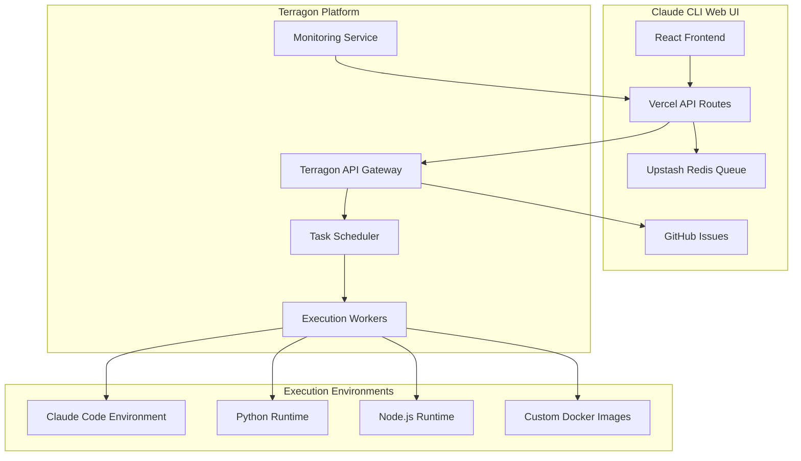

# Terragon API Integration Architecture

## Overview

Comprehensive architecture for integrating Terragon API as the scalable Claude Code execution engine within the serverless Claude CLI Web UI, providing isolated, secure, and monitored code execution environments.

## Terragon Platform Benefits

### Why Terragon API?
1. **Isolated Execution**: Secure sandboxed environments for each task
2. **Auto-scaling**: Automatic worker provisioning based on demand
3. **Pay-per-execution**: Cost-effective pricing model
4. **Multi-language Support**: Python, Node.js, Go, Rust, and more
5. **Real-time Monitoring**: Built-in execution metrics and logging
6. **Webhook Integration**: Async execution with status callbacks
7. **Resource Limits**: Configurable CPU, memory, and timeout limits

## Architecture Overview



## Terragon Service Implementation

### Core Terragon Client
```typescript
// services/TerragonService.ts
export class TerragonService {
  private apiKey: string;
  private baseUrl: string;
  private webhookUrl: string;
  
  constructor() {
    this.apiKey = process.env.TERRAGON_API_KEY!;
    this.baseUrl = process.env.TERRAGON_BASE_URL || 'https://api.terragon.ai';
    this.webhookUrl = `${process.env.VERCEL_URL}/api/terragon/webhook`;
  }

  async executeTask(task: Task): Promise<TerragonExecution> {
    const executionRequest: TerragonExecutionRequest = {
      id: task.id,
      environment: this.getEnvironmentConfig(task),
      code: this.prepareCode(task),
      timeout: task.metadata.timeout || 300,
      memory_limit: task.metadata.memory_limit || 512,
      cpu_limit: task.metadata.cpu_limit || 1,
      webhook_url: this.webhookUrl,
      metadata: {
        task_id: task.id,
        user_id: task.assignee,
        project_id: task.project_id,
        priority: task.priority
      }
    };

    const response = await this.makeRequest('POST', '/executions', executionRequest);
    
    if (!response.ok) {
      throw new TerragonError(`Failed to start execution: ${response.statusText}`);
    }

    const execution = await response.json();
    
    // Store execution reference
    await this.storeExecutionReference(task.id, execution.id);
    
    return execution;
  }

  async getExecutionStatus(executionId: string): Promise<TerragonExecution> {
    const response = await this.makeRequest('GET', `/executions/${executionId}`);
    
    if (!response.ok) {
      throw new TerragonError(`Failed to get execution status: ${response.statusText}`);
    }

    return await response.json();
  }

  async cancelExecution(executionId: string): Promise<void> {
    const response = await this.makeRequest('DELETE', `/executions/${executionId}`);
    
    if (!response.ok) {
      throw new TerragonError(`Failed to cancel execution: ${response.statusText}`);
    }
  }

  async getExecutionLogs(executionId: string, options?: LogOptions): Promise<TerragonLogs> {
    const params = new URLSearchParams();
    if (options?.lines) params.set('lines', options.lines.toString());
    if (options?.since) params.set('since', options.since);
    if (options?.level) params.set('level', options.level);

    const response = await this.makeRequest('GET', `/executions/${executionId}/logs?${params}`);
    
    if (!response.ok) {
      throw new TerragonError(`Failed to get execution logs: ${response.statusText}`);
    }

    return await response.json();
  }

  async listExecutions(filters?: ExecutionFilters): Promise<TerragonExecution[]> {
    const params = new URLSearchParams();
    if (filters?.status) params.set('status', filters.status);
    if (filters?.user_id) params.set('user_id', filters.user_id);
    if (filters?.since) params.set('since', filters.since);
    if (filters?.limit) params.set('limit', filters.limit.toString());

    const response = await this.makeRequest('GET', `/executions?${params}`);
    
    if (!response.ok) {
      throw new TerragonError(`Failed to list executions: ${response.statusText}`);
    }

    return await response.json();
  }

  private getEnvironmentConfig(task: Task): TerragonEnvironment {
    switch (task.type) {
      case 'command':
        return {
          image: 'terragon/claude-cli:latest',
          working_directory: '/workspace',
          environment_variables: {
            CLAUDE_CLI_TOKEN: process.env.CLAUDE_CLI_TOKEN!,
            TASK_ID: task.id,
            ...task.metadata.environment
          }
        };
      
      case 'chain':
        return {
          image: 'terragon/claude-cli:chain',
          working_directory: '/workspace',
          environment_variables: {
            CLAUDE_CLI_TOKEN: process.env.CLAUDE_CLI_TOKEN!,
            CHAIN_CONFIG: JSON.stringify(task.metadata.chain_config),
            TASK_ID: task.id
          }
        };
      
      case 'workflow':
        return {
          image: 'terragon/claude-cli:workflow',
          working_directory: '/workspace',
          environment_variables: {
            CLAUDE_CLI_TOKEN: process.env.CLAUDE_CLI_TOKEN!,
            WORKFLOW_CONFIG: JSON.stringify(task.metadata.workflow_config),
            TASK_ID: task.id
          }
        };
      
      default:
        return {
          image: 'terragon/claude-cli:latest',
          working_directory: '/workspace',
          environment_variables: {
            CLAUDE_CLI_TOKEN: process.env.CLAUDE_CLI_TOKEN!,
            TASK_ID: task.id
          }
        };
    }
  }

  private prepareCode(task: Task): string {
    switch (task.type) {
      case 'command':
        return this.generateCommandScript(task);
      case 'chain':
        return this.generateChainScript(task);
      case 'workflow':
        return this.generateWorkflowScript(task);
      default:
        return this.generateDefaultScript(task);
    }
  }

  private generateCommandScript(task: Task): string {
    return `#!/bin/bash
set -e

# Initialize Claude CLI session
echo "Starting Claude CLI execution for task: ${task.id}"

# Execute the command
claude code "${task.metadata.command}"

# Capture exit code
EXIT_CODE=$?

echo "Command completed with exit code: $EXIT_CODE"
exit $EXIT_CODE
`;
  }

  private generateChainScript(task: Task): string {
    const commands = task.metadata.commands || [];
    const commandList = commands.map(cmd => `claude code "${cmd}"`).join('\n');
    
    return `#!/bin/bash
set -e

echo "Starting chain execution for task: ${task.id}"

# Execute commands in sequence
${commandList}

echo "Chain execution completed successfully"
`;
  }

  private generateWorkflowScript(task: Task): string {
    return `#!/bin/bash
set -e

echo "Starting workflow execution for task: ${task.id}"

# Load workflow configuration
WORKFLOW_FILE="/tmp/workflow.json"
echo '$WORKFLOW_CONFIG' > $WORKFLOW_FILE

# Execute workflow using Claude CLI
claude code --workflow $WORKFLOW_FILE

echo "Workflow execution completed successfully"
`;
  }

  private generateDefaultScript(task: Task): string {
    return `#!/bin/bash
set -e

echo "Executing default task: ${task.id}"
echo "Task description: ${task.description}"

# Default Claude CLI help
claude code "/help"
`;
  }

  private async makeRequest(method: string, path: string, body?: any): Promise<Response> {
    const url = `${this.baseUrl}${path}`;
    const options: RequestInit = {
      method,
      headers: {
        'Authorization': `Bearer ${this.apiKey}`,
        'Content-Type': 'application/json',
        'User-Agent': 'Claude-CLI-Web-UI/1.0'
      }
    };

    if (body) {
      options.body = JSON.stringify(body);
    }

    return fetch(url, options);
  }

  private async storeExecutionReference(taskId: string, executionId: string): Promise<void> {
    const redis = new Redis(process.env.UPSTASH_REDIS_REST_URL);
    await redis.setex(`claude:executions:${taskId}`, 86400, executionId); // 24 hours
  }
}
```

### Webhook Handler
```typescript
// api/terragon/webhook.ts
import { NextRequest, NextResponse } from 'next/server';
import { TerragonService } from '../../services/TerragonService';
import { GitHubService } from '../../services/GitHubService';
import { RedisQueueService } from '../../services/RedisQueueService';

export async function POST(request: NextRequest) {
  try {
    // Verify webhook signature
    const signature = request.headers.get('x-terragon-signature');
    const body = await request.text();
    
    if (!await verifyWebhookSignature(body, signature)) {
      return NextResponse.json({ error: 'Invalid signature' }, { status: 401 });
    }

    const webhook = JSON.parse(body) as TerragonWebhook;
    
    // Process webhook based on event type
    switch (webhook.event) {
      case 'execution.started':
        await handleExecutionStarted(webhook);
        break;
      case 'execution.completed':
        await handleExecutionCompleted(webhook);
        break;
      case 'execution.failed':
        await handleExecutionFailed(webhook);
        break;
      case 'execution.timeout':
        await handleExecutionTimeout(webhook);
        break;
      case 'execution.cancelled':
        await handleExecutionCancelled(webhook);
        break;
      default:
        console.warn(`Unknown webhook event: ${webhook.event}`);
    }

    return NextResponse.json({ success: true });
  } catch (error) {
    console.error('Webhook processing error:', error);
    return NextResponse.json({ error: 'Internal server error' }, { status: 500 });
  }
}

async function handleExecutionStarted(webhook: TerragonWebhook): Promise<void> {
  const { task_id } = webhook.metadata;
  
  // Update task status in GitHub Issues
  const github = new GitHubService();
  await github.updateTask(task_id, {
    status: 'running',
    metadata: {
      terragon_execution_id: webhook.execution.id,
      started_at: webhook.execution.started_at
    }
  });

  // Update queue status
  const queue = new RedisQueueService();
  await queue.markTaskProcessing(task_id);

  // Publish real-time event
  await publishEvent('tasks', {
    type: 'task:started',
    taskId: task_id,
    executionId: webhook.execution.id,
    timestamp: Date.now()
  });
}

async function handleExecutionCompleted(webhook: TerragonWebhook): Promise<void> {
  const { task_id } = webhook.metadata;
  const execution = webhook.execution;
  
  // Get execution logs for result
  const terragon = new TerragonService();
  const logs = await terragon.getExecutionLogs(execution.id);
  
  const result: TaskResult = {
    status: 'completed',
    output: logs.stdout,
    error: logs.stderr,
    exit_code: execution.exit_code,
    duration: execution.duration,
    execution_id: execution.id,
    completed_at: execution.completed_at
  };

  // Update task in GitHub Issues
  const github = new GitHubService();
  await github.updateTask(task_id, {
    status: 'completed',
    metadata: {
      result,
      completed_at: execution.completed_at,
      duration: execution.duration
    }
  });

  // Add completion comment
  await github.addTaskComment(
    task_id,
    `✅ Task completed successfully\n\n**Duration:** ${execution.duration}ms\n**Exit Code:** ${execution.exit_code}`,
    'terragon-bot'
  );

  // Complete task in queue
  const queue = new RedisQueueService();
  await queue.completeTask(task_id, result);

  // Publish completion event
  await publishEvent('tasks', {
    type: 'task:completed',
    taskId: task_id,
    result,
    timestamp: Date.now()
  });

  // Process any child tasks
  await processChildTasks(task_id);
}

async function handleExecutionFailed(webhook: TerragonWebhook): Promise<void> {
  const { task_id } = webhook.metadata;
  const execution = webhook.execution;
  
  // Get execution logs for error details
  const terragon = new TerragonService();
  const logs = await terragon.getExecutionLogs(execution.id);
  
  const error: TaskError = {
    message: execution.error_message || 'Execution failed',
    code: execution.exit_code || -1,
    stdout: logs.stdout,
    stderr: logs.stderr,
    execution_id: execution.id,
    failed_at: execution.failed_at
  };

  // Update task in GitHub Issues
  const github = new GitHubService();
  await github.updateTask(task_id, {
    status: 'failed',
    metadata: {
      error,
      failed_at: execution.failed_at
    }
  });

  // Add failure comment
  await github.addTaskComment(
    task_id,
    `❌ Task failed\n\n**Error:** ${error.message}\n**Exit Code:** ${error.code}\n\n**Stderr:**\n\`\`\`\n${error.stderr}\n\`\`\``,
    'terragon-bot'
  );

  // Handle failure in queue (with retry if appropriate)
  const queue = new RedisQueueService();
  const shouldRetry = isRetryableError(error);
  await queue.failTask(task_id, error, shouldRetry);

  // Publish failure event
  await publishEvent('tasks', {
    type: 'task:failed',
    taskId: task_id,
    error,
    timestamp: Date.now()
  });
}

async function handleExecutionTimeout(webhook: TerragonWebhook): Promise<void> {
  const { task_id } = webhook.metadata;
  const execution = webhook.execution;
  
  const error: TaskError = {
    message: 'Execution timed out',
    code: -2,
    execution_id: execution.id,
    failed_at: execution.failed_at || new Date().toISOString()
  };

  // Update task status
  const github = new GitHubService();
  await github.updateTask(task_id, {
    status: 'failed',
    metadata: {
      error,
      timeout: true,
      failed_at: error.failed_at
    }
  });

  // Add timeout comment
  await github.addTaskComment(
    task_id,
    `⏰ Task timed out after ${execution.timeout}s`,
    'terragon-bot'
  );

  // Handle timeout in queue
  const queue = new RedisQueueService();
  await queue.failTask(task_id, error, false); // Don't retry timeouts

  // Publish timeout event
  await publishEvent('tasks', {
    type: 'task:timeout',
    taskId: task_id,
    timeout: execution.timeout,
    timestamp: Date.now()
  });
}

async function processChildTasks(parentTaskId: string): Promise<void> {
  const github = new GitHubService();
  const parentTask = await github.getTask(parentTaskId);
  
  if (parentTask?.metadata.child_task_ids) {
    const childIds = parentTask.metadata.child_task_ids;
    
    // Queue child tasks for execution
    for (const childId of childIds) {
      const childTask = await github.getTask(childId);
      if (childTask && childTask.status === 'pending') {
        const queue = new RedisQueueService();
        await queue.enqueueTask(childTask);
      }
    }
  }
}

function isRetryableError(error: TaskError): boolean {
  // Define retryable error conditions
  const retryableExitCodes = [130, 143]; // SIGINT, SIGTERM
  const retryableMessages = [
    'network error',
    'connection timeout',
    'temporary failure',
    'rate limit exceeded'
  ];
  
  if (retryableExitCodes.includes(error.code)) {
    return true;
  }
  
  const errorMessage = error.message.toLowerCase();
  return retryableMessages.some(msg => errorMessage.includes(msg));
}

async function verifyWebhookSignature(body: string, signature: string | null): Promise<boolean> {
  if (!signature || !process.env.TERRAGON_WEBHOOK_SECRET) {
    return false;
  }
  
  const crypto = await import('crypto');
  const expectedSignature = crypto
    .createHmac('sha256', process.env.TERRAGON_WEBHOOK_SECRET)
    .update(body)
    .digest('hex');
  
  return `sha256=${expectedSignature}` === signature;
}

async function publishEvent(channel: string, event: any): Promise<void> {
  const pubsub = new RedisPubSubService();
  await pubsub.publishEvent(channel, event);
}
```

### Task Execution Orchestrator
```typescript
// services/TaskExecutionOrchestrator.ts
export class TaskExecutionOrchestrator {
  private terragon: TerragonService;
  private github: GitHubService;
  private queue: RedisQueueService;
  
  constructor() {
    this.terragon = new TerragonService();
    this.github = new GitHubService();
    this.queue = new RedisQueueService();
  }

  async processNextTask(): Promise<boolean> {
    // Dequeue highest priority task
    const queuedTask = await this.queue.dequeueTask();
    
    if (!queuedTask) {
      return false; // No tasks available
    }

    try {
      // Get full task details from GitHub
      const task = await this.github.getTask(queuedTask.id);
      if (!task) {
        throw new Error(`Task ${queuedTask.id} not found`);
      }

      // Validate task before execution
      await this.validateTask(task);

      // Start execution on Terragon
      const execution = await this.terragon.executeTask(task);
      
      console.log(`Started execution ${execution.id} for task ${task.id}`);
      return true;
      
    } catch (error) {
      console.error(`Failed to process task ${queuedTask.id}:`, error);
      
      // Mark task as failed
      await this.queue.failTask(queuedTask.id, {
        message: error.message,
        code: -1,
        failed_at: new Date().toISOString()
      });
      
      return true; // Continue processing other tasks
    }
  }

  async validateTask(task: Task): Promise<void> {
    // Validate task structure
    if (!task.metadata?.command && !task.metadata?.commands && !task.metadata?.workflow_config) {
      throw new Error('Task missing execution configuration');
    }

    // Validate timeout
    const timeout = task.metadata.timeout;
    if (timeout && (timeout < 1 || timeout > 3600)) {
      throw new Error('Task timeout must be between 1 and 3600 seconds');
    }

    // Validate memory limit
    const memoryLimit = task.metadata.memory_limit;
    if (memoryLimit && (memoryLimit < 128 || memoryLimit > 4096)) {
      throw new Error('Task memory limit must be between 128MB and 4GB');
    }

    // Validate command safety
    if (task.metadata.command) {
      await this.validateCommand(task.metadata.command);
    }

    if (task.metadata.commands) {
      for (const command of task.metadata.commands) {
        await this.validateCommand(command);
      }
    }
  }

  private async validateCommand(command: string): Promise<void> {
    // Use existing security validation from current system
    const CommandSanitizer = await import('../services/claude_cli/security');
    const sanitizer = new CommandSanitizer.CommandSanitizer();
    
    const validation = await sanitizer.validateCommand(command);
    if (!validation.safe) {
      throw new Error(`Unsafe command detected: ${validation.reason}`);
    }
  }

  async cancelTask(taskId: string): Promise<void> {
    // Get Terragon execution ID
    const redis = new Redis(process.env.UPSTASH_REDIS_REST_URL);
    const executionId = await redis.get(`claude:executions:${taskId}`);
    
    if (executionId) {
      // Cancel execution on Terragon
      await this.terragon.cancelExecution(executionId);
    }

    // Update task status
    await this.github.updateTask(taskId, {
      status: 'cancelled',
      metadata: {
        cancelled_at: new Date().toISOString()
      }
    });

    // Remove from queue if still pending
    await this.queue.removeTask(taskId);
  }

  async getTaskProgress(taskId: string): Promise<TaskProgress | null> {
    // Get Terragon execution ID
    const redis = new Redis(process.env.UPSTASH_REDIS_REST_URL);
    const executionId = await redis.get(`claude:executions:${taskId}`);
    
    if (!executionId) {
      return null;
    }

    // Get execution status from Terragon
    const execution = await this.terragon.getExecutionStatus(executionId);
    
    return {
      taskId,
      executionId,
      status: execution.status,
      progress: execution.progress || 0,
      currentStep: execution.current_step,
      totalSteps: execution.total_steps,
      elapsedTime: execution.elapsed_time,
      estimatedRemaining: execution.estimated_remaining
    };
  }
}
```

## Advanced Features

### Execution Templates
```typescript
// Pre-configured execution templates for common tasks
export const EXECUTION_TEMPLATES = {
  'claude-help': {
    image: 'terragon/claude-cli:latest',
    timeout: 30,
    memory_limit: 256,
    cpu_limit: 0.5,
    command: '/help'
  },
  
  'project-init': {
    image: 'terragon/claude-cli:project',
    timeout: 600,
    memory_limit: 1024,
    cpu_limit: 1,
    commands: ['/init-project', '/smart-task setup']
  },
  
  'security-audit': {
    image: 'terragon/claude-cli:security',
    timeout: 1800,
    memory_limit: 2048,
    cpu_limit: 2,
    workflow: 'security-audit.yml'
  },
  
  'performance-test': {
    image: 'terragon/claude-cli:performance',
    timeout: 900,
    memory_limit: 1024,
    cpu_limit: 1,
    workflow: 'performance-test.yml'
  }
};
```

### Resource Scaling
```typescript
// Dynamic resource allocation based on task complexity
export class ResourceScaler {
  static calculateResources(task: Task): TerragonResources {
    const baseResources = {
      memory_limit: 512,
      cpu_limit: 1,
      timeout: 300
    };

    // Scale based on task type
    switch (task.type) {
      case 'workflow':
        return {
          memory_limit: 2048,
          cpu_limit: 2,
          timeout: 1800
        };
      
      case 'chain':
        const commandCount = task.metadata.commands?.length || 1;
        return {
          memory_limit: Math.min(512 + (commandCount * 128), 4096),
          cpu_limit: Math.min(1 + (commandCount * 0.5), 4),
          timeout: Math.min(300 + (commandCount * 60), 3600)
        };
      
      default:
        return baseResources;
    }
  }

  static estimateCost(resources: TerragonResources): number {
    // Estimate execution cost based on resources
    const baseCost = 0.01; // $0.01 base
    const memoryCost = (resources.memory_limit / 1024) * 0.005;
    const cpuCost = resources.cpu_limit * 0.01;
    const timeCost = (resources.timeout / 60) * 0.001;
    
    return baseCost + memoryCost + cpuCost + timeCost;
  }
}
```

### Execution Monitoring
```typescript
// Real-time execution monitoring
export class ExecutionMonitor {
  private ws: WebSocket | null = null;
  
  async startMonitoring(executionId: string): Promise<void> {
    const wsUrl = `${process.env.TERRAGON_WS_URL}/executions/${executionId}/monitor`;
    
    this.ws = new WebSocket(wsUrl, {
      headers: {
        'Authorization': `Bearer ${process.env.TERRAGON_API_KEY}`
      }
    });

    this.ws.on('message', (data) => {
      const event = JSON.parse(data.toString());
      this.handleMonitorEvent(event);
    });
  }

  private async handleMonitorEvent(event: TerragonMonitorEvent): Promise<void> {
    switch (event.type) {
      case 'resource_usage':
        await this.updateResourceMetrics(event.data);
        break;
      case 'log_line':
        await this.streamLogLine(event.data);
        break;
      case 'progress_update':
        await this.updateProgress(event.data);
        break;
    }
  }

  private async updateResourceMetrics(data: ResourceUsage): Promise<void> {
    const redis = new Redis(process.env.UPSTASH_REDIS_REST_URL);
    await redis.setex(
      `claude:metrics:execution:${data.execution_id}`,
      300,
      JSON.stringify(data)
    );
  }

  private async streamLogLine(data: LogLine): Promise<void> {
    // Stream log lines to real-time UI
    const pubsub = new RedisPubSubService();
    await pubsub.publishEvent(`execution:${data.execution_id}:logs`, {
      type: 'log_line',
      timestamp: data.timestamp,
      level: data.level,
      message: data.message
    });
  }
}
```

## API Endpoints

### Execution Management
```typescript
// api/terragon/execute.ts
export async function POST(request: NextRequest) {
  const { task_id } = await request.json();
  
  const orchestrator = new TaskExecutionOrchestrator();
  const github = new GitHubService();
  
  // Get task details
  const task = await github.getTask(task_id);
  if (!task) {
    return NextResponse.json({ error: 'Task not found' }, { status: 404 });
  }

  try {
    // Validate and execute task
    await orchestrator.validateTask(task);
    const execution = await orchestrator.executeTask(task);
    
    return NextResponse.json({ execution });
  } catch (error) {
    return NextResponse.json({ error: error.message }, { status: 400 });
  }
}

// api/terragon/status/[executionId].ts
export async function GET(
  request: NextRequest,
  { params }: { params: { executionId: string } }
) {
  const terragon = new TerragonService();
  
  try {
    const execution = await terragon.getExecutionStatus(params.executionId);
    return NextResponse.json({ execution });
  } catch (error) {
    return NextResponse.json({ error: error.message }, { status: 404 });
  }
}

// api/terragon/logs/[executionId].ts
export async function GET(
  request: NextRequest,
  { params }: { params: { executionId: string } }
) {
  const { searchParams } = new URL(request.url);
  const lines = parseInt(searchParams.get('lines') || '100');
  const level = searchParams.get('level');
  
  const terragon = new TerragonService();
  
  try {
    const logs = await terragon.getExecutionLogs(params.executionId, {
      lines,
      level
    });
    
    return NextResponse.json({ logs });
  } catch (error) {
    return NextResponse.json({ error: error.message }, { status: 404 });
  }
}

// api/terragon/cancel/[executionId].ts
export async function POST(
  request: NextRequest,
  { params }: { params: { executionId: string } }
) {
  const terragon = new TerragonService();
  
  try {
    await terragon.cancelExecution(params.executionId);
    return NextResponse.json({ success: true });
  } catch (error) {
    return NextResponse.json({ error: error.message }, { status: 400 });
  }
}
```

## Performance Optimization

### Execution Pooling
```typescript
// Pool of pre-warmed execution environments
export class ExecutionPool {
  private pool: Map<string, TerragonEnvironment[]> = new Map();
  private readonly MAX_POOL_SIZE = 10;
  
  async getWarmEnvironment(imageType: string): Promise<TerragonEnvironment | null> {
    const environments = this.pool.get(imageType) || [];
    
    if (environments.length > 0) {
      return environments.pop()!;
    }
    
    return null;
  }
  
  async preWarmEnvironments(): Promise<void> {
    const imageTypes = ['claude-cli:latest', 'claude-cli:chain', 'claude-cli:workflow'];
    
    for (const imageType of imageTypes) {
      const currentPool = this.pool.get(imageType) || [];
      const needed = this.MAX_POOL_SIZE - currentPool.length;
      
      if (needed > 0) {
        const warmRequests = Array(needed).fill(null).map(() => 
          this.createWarmEnvironment(imageType)
        );
        
        const environments = await Promise.all(warmRequests);
        this.pool.set(imageType, [...currentPool, ...environments]);
      }
    }
  }
  
  private async createWarmEnvironment(imageType: string): Promise<TerragonEnvironment> {
    // Create pre-warmed environment
    const response = await fetch(`${process.env.TERRAGON_BASE_URL}/environments/warm`, {
      method: 'POST',
      headers: {
        'Authorization': `Bearer ${process.env.TERRAGON_API_KEY}`,
        'Content-Type': 'application/json'
      },
      body: JSON.stringify({
        image: `terragon/${imageType}`,
        keep_warm: true
      })
    });
    
    return await response.json();
  }
}
```

### Intelligent Scheduling
```typescript
// Smart task scheduling based on resource availability
export class TaskScheduler {
  async scheduleOptimalExecution(task: Task): Promise<TerragonExecution> {
    // Get current resource availability
    const availability = await this.getResourceAvailability();
    
    // Calculate optimal resources
    const resources = ResourceScaler.calculateResources(task);
    
    // Find best execution slot
    const optimalSlot = await this.findOptimalSlot(resources, availability);
    
    if (optimalSlot.immediate) {
      // Execute immediately
      return await this.executeTask(task, resources);
    } else {
      // Schedule for later execution
      await this.scheduleDelayedExecution(task, optimalSlot.scheduledTime);
      throw new Error(`Task scheduled for execution at ${optimalSlot.scheduledTime}`);
    }
  }
  
  private async getResourceAvailability(): Promise<ResourceAvailability> {
    const response = await fetch(`${process.env.TERRAGON_BASE_URL}/resources/availability`, {
      headers: {
        'Authorization': `Bearer ${process.env.TERRAGON_API_KEY}`
      }
    });
    
    return await response.json();
  }
}
```

## Cost Monitoring & Optimization

### Cost Tracking
```typescript
// Track execution costs and optimize resource allocation
export class CostTracker {
  async trackExecutionCost(execution: TerragonExecution): Promise<void> {
    const cost = this.calculateExecutionCost(execution);
    
    // Store cost data
    const redis = new Redis(process.env.UPSTASH_REDIS_REST_URL);
    await redis.zadd('claude:costs:executions', Date.now(), JSON.stringify({
      execution_id: execution.id,
      task_id: execution.metadata.task_id,
      cost,
      duration: execution.duration,
      resources: execution.resources
    }));
    
    // Update daily cost totals
    const today = new Date().toISOString().split('T')[0];
    await redis.incrbyfloat(`claude:costs:daily:${today}`, cost);
  }
  
  async getDailyCosts(days: number = 30): Promise<DailyCost[]> {
    const redis = new Redis(process.env.UPSTASH_REDIS_REST_URL);
    const costs: DailyCost[] = [];
    
    for (let i = 0; i < days; i++) {
      const date = new Date();
      date.setDate(date.getDate() - i);
      const dateKey = date.toISOString().split('T')[0];
      
      const cost = await redis.get(`claude:costs:daily:${dateKey}`);
      costs.push({
        date: dateKey,
        cost: parseFloat(cost || '0')
      });
    }
    
    return costs;
  }
  
  private calculateExecutionCost(execution: TerragonExecution): number {
    const baseCost = 0.01; // Base cost per execution
    const resourceCost = ResourceScaler.estimateCost(execution.resources);
    const durationCost = (execution.duration / 1000 / 60) * 0.001; // $0.001 per minute
    
    return baseCost + resourceCost + durationCost;
  }
}
```

This Terragon API integration provides a robust, scalable, and cost-effective execution platform for Claude Code tasks with comprehensive monitoring, security, and optimization features.