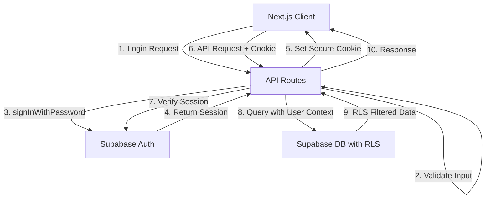

# Secure Authentication System Design
## Backend Architect Analysis Report

### 1. Critical Security Issues Identified

1. **Service Key Exposure**: All API routes use `serviceKey` which bypasses RLS - CRITICAL vulnerability
2. **Custom JWT Implementation**: Bypasses Supabase's built-in auth, creating security risks
3. **No Rate Limiting**: APIs vulnerable to brute force attacks
4. **Information Leakage**: Error messages reveal system internals
5. **No CSRF Protection**: Vulnerable to cross-site request forgery

### 2. Authentication Architecture Design



### 3. API Endpoint Specifications

#### POST /api/auth/login
```typescript
// Request
{
  email: string (validated email format),
  password: string (min 8 chars)
}

// Response (200 OK)
{
  user: {
    id: string,
    email: string,
    firstName: string,
    lastName: string
  }
}
// Cookie: sb-access-token (httpOnly, secure, sameSite=strict)

// Error Response (400/401)
{
  error: {
    code: "INVALID_CREDENTIALS",
    message: "Invalid email or password"
  }
}
```

#### POST /api/auth/register
```typescript
// Request
{
  email: string (validated),
  password: string (validated),
  firstName: string (2-50 chars),
  lastName: string (2-50 chars)
}

// Response (201 Created)
{
  user: {
    id: string,
    email: string,
    firstName: string,
    lastName: string
  }
}

// Error Response (400)
{
  error: {
    code: "EMAIL_EXISTS" | "VALIDATION_ERROR",
    message: string,
    fields?: Record<string, string>
  }
}
```

#### GET /api/auth/me
```typescript
// Headers: Cookie with sb-access-token

// Response (200 OK)
{
  user: {
    id: string,
    email: string,
    firstName: string,
    lastName: string,
    createdAt: string
  }
}

// Error Response (401)
{
  error: {
    code: "UNAUTHORIZED",
    message: "Authentication required"
  }
}
```

#### POST /api/auth/logout
```typescript
// Headers: Cookie with sb-access-token

// Response (200 OK)
{
  message: "Logged out successfully"
}
// Clears sb-access-token cookie
```

### 4. Supabase RLS Policies

```sql
-- Enable RLS on users table
ALTER TABLE users ENABLE ROW LEVEL SECURITY;

-- Policy: Users can only read their own profile
CREATE POLICY "Users can view own profile" ON users
  FOR SELECT USING (auth.uid() = id);

-- Policy: Users can update their own profile
CREATE POLICY "Users can update own profile" ON users
  FOR UPDATE USING (auth.uid() = id)
  WITH CHECK (auth.uid() = id);

-- Policy: No direct inserts (handled by auth trigger)
CREATE POLICY "No direct user inserts" ON users
  FOR INSERT WITH CHECK (false);

-- Enable RLS on projects table
ALTER TABLE projects ENABLE ROW LEVEL SECURITY;

-- Policy: Users can CRUD their own projects
CREATE POLICY "Users manage own projects" ON projects
  FOR ALL USING (auth.uid() = user_id)
  WITH CHECK (auth.uid() = user_id);

-- Function to auto-create user profile on signup
CREATE OR REPLACE FUNCTION handle_new_user()
RETURNS TRIGGER AS $$
BEGIN
  INSERT INTO public.users (id, email, created_at)
  VALUES (NEW.id, NEW.email, NOW());
  RETURN NEW;
END;
$$ LANGUAGE plpgsql SECURITY DEFINER;

-- Trigger for auto-creating profiles
CREATE TRIGGER on_auth_user_created
  AFTER INSERT ON auth.users
  FOR EACH ROW EXECUTE FUNCTION handle_new_user();
```

### 5. Session Management Strategy

**Use HTTP-Only Cookies** for session storage:
- **Security**: Prevents XSS attacks from accessing tokens
- **Configuration**:
  ```typescript
  // Cookie settings
  {
    httpOnly: true,
    secure: process.env.NODE_ENV === 'production',
    sameSite: 'strict',
    maxAge: 60 * 60 * 24 * 7, // 7 days
    path: '/'
  }
  ```

**Why not localStorage**:
- Vulnerable to XSS attacks
- Can't be used for SSR
- No automatic expiry

### 6. Rate Limiting Design

```typescript
// Rate limiter configuration
const rateLimits = {
  login: {
    windowMs: 15 * 60 * 1000, // 15 minutes
    max: 5, // 5 attempts per window
    skipSuccessfulRequests: true
  },
  register: {
    windowMs: 60 * 60 * 1000, // 1 hour
    max: 3, // 3 registrations per hour per IP
  },
  api: {
    windowMs: 1 * 60 * 1000, // 1 minute
    max: 60, // 60 requests per minute
  }
};

// Implementation approach
- Use Vercel KV or Upstash Redis for distributed rate limiting
- IP-based for auth endpoints
- User-based for authenticated API calls
- Exponential backoff for repeated violations
```

### 7. Input Validation Schema (Zod)

```typescript
// schemas/auth.ts
import { z } from 'zod';

export const loginSchema = z.object({
  email: z.string().email('Invalid email format'),
  password: z.string().min(8, 'Password must be at least 8 characters')
});

export const registerSchema = z.object({
  email: z.string().email('Invalid email format'),
  password: z.string()
    .min(8, 'Password must be at least 8 characters')
    .regex(/[A-Z]/, 'Password must contain uppercase letter')
    .regex(/[a-z]/, 'Password must contain lowercase letter')
    .regex(/[0-9]/, 'Password must contain number'),
  firstName: z.string()
    .min(2, 'First name too short')
    .max(50, 'First name too long')
    .regex(/^[a-zA-Z\s-']+$/, 'Invalid characters in first name'),
  lastName: z.string()
    .min(2, 'Last name too short')
    .max(50, 'Last name too long')
    .regex(/^[a-zA-Z\s-']+$/, 'Invalid characters in last name')
});
```

### 8. Migration Plan

1. **Phase 1: Create new auth utilities**
   - Supabase client factory with proper keys
   - Cookie-based session management
   - Input validation middleware

2. **Phase 2: Update API routes**
   - Replace serviceKey with server-side auth client
   - Implement cookie-based sessions
   - Add input validation
   - Add rate limiting

3. **Phase 3: Update frontend**
   - Remove JWT token storage
   - Update auth store to use cookies
   - Handle new error response format

4. **Phase 4: Database migration**
   - Enable RLS policies
   - Create auth trigger
   - Test with limited users

5. **Phase 5: Cleanup**
   - Remove old JWT utilities
   - Remove serviceKey from env
   - Security audit

### 9. Technology Recommendations

1. **@supabase/ssr** - Server-side Supabase client for Next.js
2. **zod** - Runtime type validation
3. **@upstash/ratelimit** - Serverless rate limiting
4. **helmet** - Security headers middleware
5. **csrf** - CSRF protection for mutations

### 10. Potential Bottlenecks & Scaling

1. **Rate Limiting Storage**: Use Redis for distributed rate limiting across serverless functions
2. **Session Validation**: Cache valid sessions in Redis (5-minute TTL) to reduce auth checks
3. **Database Queries**: Add indexes on frequently queried fields (email, user_id)
4. **Monitoring**: Implement auth event logging for security monitoring

This design prioritizes security while maintaining good performance and user experience. The migration can be done incrementally without breaking existing functionality.